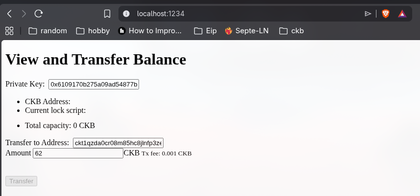
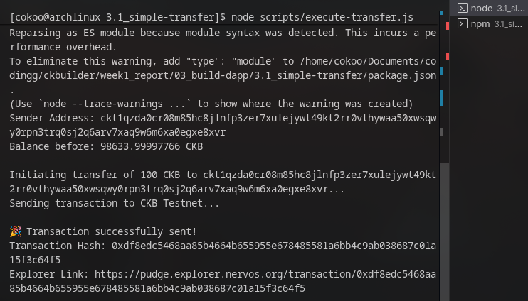

# 🏗️ 03 - Building dApps on CKB

> **Comprehensive Practical dApp Development & Script Interaction Suite**  
> A structured series of 6 hands-on dApp development exercises based on the official Nervos Network documentation and CKB Builder Handbook.

---

## 🧭 Overview & Module Index

This section covers the core building blocks of decentralized application development on Nervos CKB using modern TypeScript toolchains, Common Chain Connector (**CCC**), and on-chain scripting models.

| No. | Module Name | Description | Status |
| :---: | :--- | :--- | :---: |
| **3.1** | [**Simple Transfer**](./3.1_simple-transfer/README.md) | Basic CKB token transfer and transaction construction via CCC | 🟢 **Validated On-Chain** ([Tx Proof](https://pudge.explorer.nervos.org/transaction/0x346797358df026210b3432366e9515c12c0872445a09ce6a5d7367e860571b2b)) |
| **3.2** | [**Store Data on Cell**](./3.2_store-data-on-cell/README.md) | Writing and reading arbitrary on-chain state/data in Cell capacity | 🟡 Ready for Testing |
| **3.3** | [**Create DOB (Spore Protocol)**](./3.3_create-dob/README.md) | Minting Digital Objects (DOBs) with on-chain value backing | 🟡 Ready for Testing |
| **3.4** | [**xUDT (Extensible UDT)**](./3.4_xudt/README.md) | Minting and managing programmable fungible tokens on CKB | 🟡 Ready for Testing |
| **3.5** | [**Simple Lock**](./3.5_simple-lock/README.md) | Custom Lock Script contract and frontend wallet integration | 🟡 Ready for Testing |
| **3.6** | [**CCC Molecule Serialization**](./3.6_ccc-molecule/README.md) | Molecule binary serialization schema encoding/decoding | 🟡 Ready for Testing |

---

## 📸 Executive Proof & Screenshot Gallery
*(Proof of work for each material will be embedded below)*

### 3.1 Simple Transfer



### 3.2 Store Data on Cell
```
[Insert 3.2 Store Data on Cell Screenshot Here]
```

### 3.3 Create DOB (Spore Protocol)
```
[Insert 3.3 Create DOB Screenshot Here]
```

### 3.4 xUDT Token
```
[Insert 3.4 xUDT Token Screenshot Here]
```

### 3.5 Simple Lock
```
[Insert 3.5 Simple Lock Screenshot Here]
```

### 3.6 CCC Molecule
```
[Insert 3.6 CCC Molecule Screenshot Here]
```

---

## 🛠️ Toolchain & Tech Stack
- **Frameworks**: Next.js, React, Node.js (TypeScript)
- **CKB SDK**: `@ckb-ccc/core`, `@ckb-ccc/connector-react`
- **Protocols**: Spore Protocol (DOBs), xUDT Standard (RFC 0052), Molecule Serializer
- **Target Networks**: CKB Testnet (Pudge) & Local Devnet
