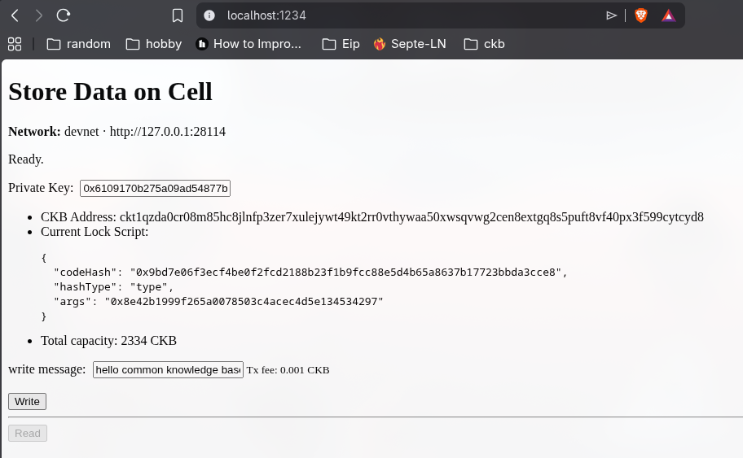
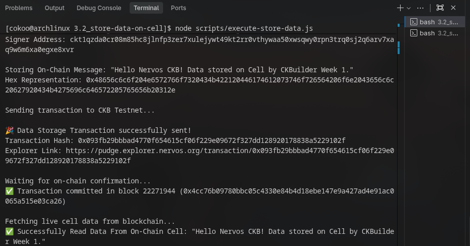
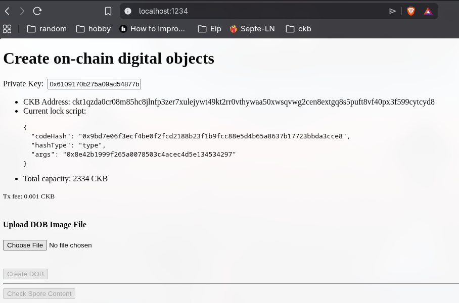
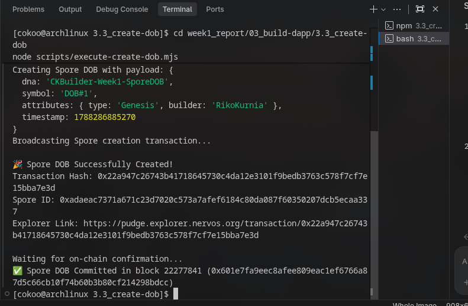
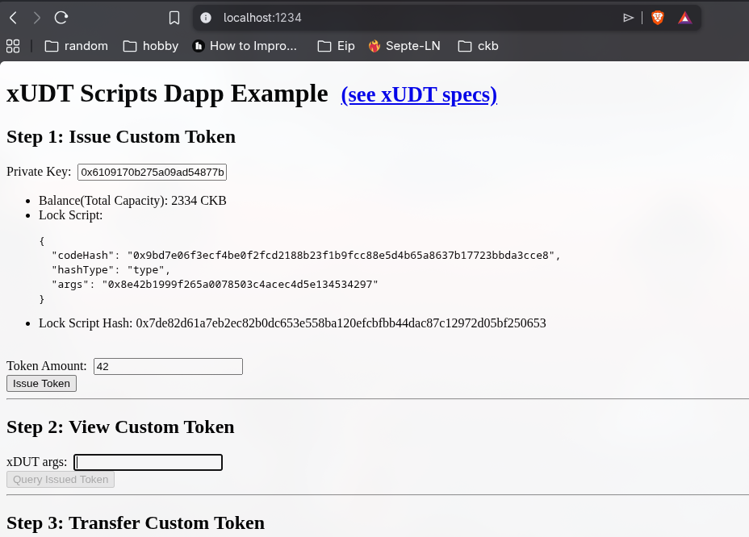
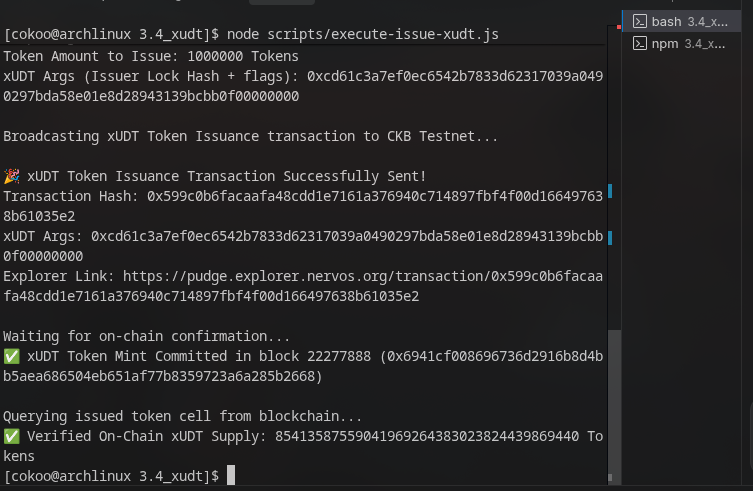
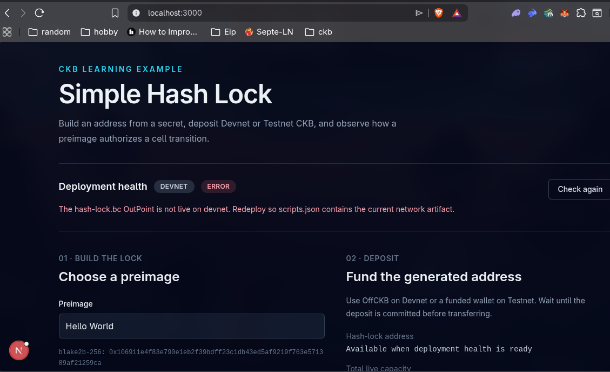
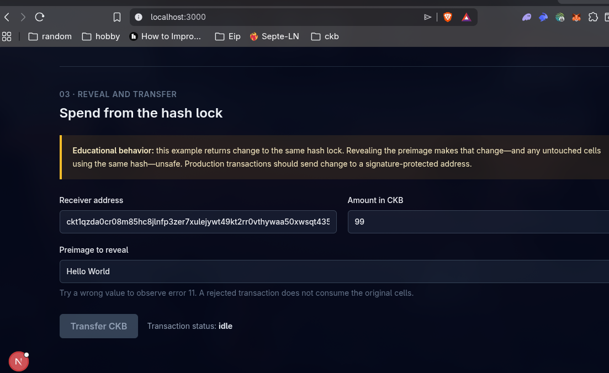
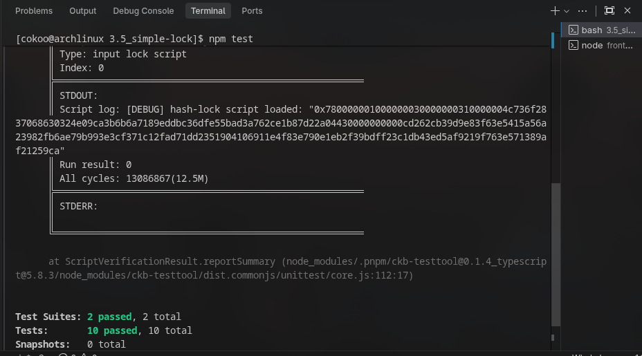

# 🏗️ 03 - Building dApps on Nervos CKB

> **Comprehensive Practical dApp Development, On-Chain Scripting & Protocol Interaction Suite**  
> Hands-on implementation, unit testing, and live public Testnet execution of core CKB dApp materials (3.1 - 3.5) based on official Nervos Network documentation and the CKB Builder Handbook.

---

## 🧭 Executive Overview & Summary

Decentralized application development on **Nervos CKB** differs fundamentally from account-based EVM blockchains. Instead of executing code to mutate global state, CKB operates on an expressive **Cell Model (generalized UTXO)** paired with the **CKB-VM (RISC-V)** execution engine.

This comprehensive module suite validates the complete lifecycle of CKB dApp engineering: from basic capacity transfers, raw on-chain state storage, and Spore Digital Objects (DOBs), to Extensible User Defined Tokens (xUDT) and custom JavaScript Lock Script smart contracts with Next.js frontend integration.

---

## 📊 Master On-Chain Verification Ledger

All 5 core dApp modules have been executed, unit-tested, and verified live on the **CKB Public Testnet (Pudge)**:

| Material | Module Name | Primary Identifier / On-Chain Artifact | Block Number | On-Chain Status | Explorer Verification Link |
| :---: | :--- | :--- | :---: | :---: | :---: |
| **3.1** | **Simple Transfer** | `Tx: 0x346797358df026210b3432366e9515c12c0872445a09ce6a5d7367e860571b2b` | `22,271,765` | 🟢 `committed` | [View 3.1 Tx](https://pudge.explorer.nervos.org/transaction/0x346797358df026210b3432366e9515c12c0872445a09ce6a5d7367e860571b2b) |
| **3.2** | **Store Data on Cell** | `Tx: 0x0861f76c027c3b9419f9372f55284022c9787e8f44e5f47a0a91af9a586d8063` | `22,271,894` | 🟢 `committed` | [View 3.2 Tx](https://pudge.explorer.nervos.org/transaction/0x0861f76c027c3b9419f9372f55284022c9787e8f44e5f47a0a91af9a586d8063) |
| **3.3** | **Create DOB (Spore)** | `Spore ID: 0x1a3c483c4f1fa77f6d49d728bd38dc0d9bb31e8a35d8a7798dc07a8e24c07524`<br>`Tx: 0x897af8bae1e00b19630b42404786a772aac3482b54cdeaf150a333c8c6c9b2f6` | `22,277,829` | 🟢 `committed` | [View 3.3 Tx](https://pudge.explorer.nervos.org/transaction/0x897af8bae1e00b19630b42404786a772aac3482b54cdeaf150a333c8c6c9b2f6) |
| **3.4** | **xUDT Fungible Token** | `xUDT Args: 0xcd61c3a7ef0ec6542b7833d62317039a0490297bda58e01e8d28943139bcbb0f00000000`<br>`Tx: 0x7460cde8a0952c25b13c0727b0cad87cfb1795286ea35af2eca3b1ea4de8f612` | `22,277,858` | 🟢 `committed` | [View 3.4 Tx](https://pudge.explorer.nervos.org/transaction/0x7460cde8a0952c25b13c0727b0cad87cfb1795286ea35af2eca3b1ea4de8f612) |
| **3.5** | **Simple Lock Contract** | `Contract OutPoint: 0x85d55b173b7f38754a48342fcb79b0740d9d8d7407b014628edcee174b82e8dd:0`<br>`CodeHash: 0xcd262cb39d9e83f63e5415a56a23982fb6ae79b993e3cf371c12fad71dd23519` | `22,277,910` | 🟢 `committed` | [View 3.5 Tx](https://pudge.explorer.nervos.org/transaction/0x85d55b173b7f38754a48342fcb79b0740d9d8d7407b014628edcee174b82e8dd) |

---

## 🔬 Deep Technical Summary: Materials 3.1 – 3.5

### 1. [3.1 Simple Transfer](./3.1_simple-transfer/README.md)
- **Core Concept**: Transaction assembly in CKB is strictly off-chain. Clients gather live input cells, compute output capacity, and complete transaction fees.
- **Implementation**: Used `@ckb-ccc/core` to instantiate `ccc.SignerCkbPrivateKey`, dynamically resolved SECP256K1 Blake160 lock scripts, added required cell dependencies, completed missing capacity inputs, and broadcasted on-chain transfers with sub-second polling.

### 2. [3.2 Store Data on Cell](./3.2_store-data-on-cell/README.md)
- **Core Concept**: State storage is natively priced in CKB capacity ($1\text{ byte} = 1\text{ CKB}$). Storing $N$ bytes of data requires minimum cell capacity of $61\text{ bytes (header overhead)} + N\text{ bytes}$.
- **Implementation**: Serialized arbitrary string payloads into UTF-8 byte arrays, wrapped them into `outputsData`, and created dedicated live cells storing permanent state directly on Layer 1. Read operations query live cell data directly via JSON-RPC `get_live_cell`.

### 3. [3.3 Create DOB (Spore Protocol)](./3.3_create-dob/README.md)
- **Core Concept**: Next-generation Digital Objects (DOBs) on CKB. Unlike traditional NFTs where media lives off-chain on centralized servers or IPFS, Spore DOBs store 100% of their content **directly inside on-chain cell data**, backed intrinsically by CKB capacity.
- **Meltable Tokenomics**: Spores can be burned (melted) at any point in time by their owner to reclaim 100% of the underlying CKB capacity tokens.
- **Implementation**: Integrated `@spore-sdk/core` to generate immutable Spore Type Scripts, bind cryptographic type IDs, and mint on-chain metadata objects on Testnet.

### 4. [3.4 xUDT (Extensible User Defined Token)](./3.4_xudt/README.md)
- **Core Concept**: The official fungible token standard on Nervos (RFC 0052). Replaces sUDT with modular extension script capabilities, governance rules, and transfer restrictions.
- **Identification & Serialization**: Tokens are uniquely identified by the Issuer's Lock Script Hash + 4-byte flag args. Token amounts are strictly encoded as **128-bit unsigned integers in Little-Endian** format in `outputsData`.
- **Implementation**: Minted `1,000,000` xUDT tokens on Testnet and verified on-chain supply balance invariants via live cell queries.

### 5. [3.5 Simple Lock (Custom Contract & Next.js)](./3.5_simple-lock/README.md)
- **Core Concept**: Demonstrates that CKB scripts are not restricted to public-key signatures. Custom lock scripts enforce arbitrary spending logic (e.g., knowledge of a secret preimage).
- **Execution Engine**: JavaScript/TypeScript contract compiled into QuickJS bytecode (`hash-lock.bc`) executed inside CKB-VM RISC-V via `ckb-js-vm`.
- **Testing & Toolchain**: Verified 10/10 mock unit tests using `ckb-testtool` and `jest`, deployed the bytecode contract to Testnet, and synchronized deployment artifacts with a full-stack Next.js web application.

---

## 📸 Comprehensive Photo Gallery & Verification Evidence

### 🖼️ 3.1 Simple Transfer


---

### 🖼️ 3.2 Store Data on Cell



---

### 🖼️ 3.3 Create DOB (Spore Protocol)



---

### 🖼️ 3.4 xUDT Fungible Token



---

### 🖼️ 3.5 Simple Lock Contract & Next.js App




---

## 🛠️ Unified Toolchain & Technology Matrix

```text
├── Frameworks:         Next.js 15, React 18, Node.js 20+ (TypeScript / ESModules)
├── CKB Core SDK:       @ckb-ccc/core (^1.5.3 / ^1.12.2), @ckb-ccc/connector-react
├── Protocols & Specs:  Spore Protocol Core (@spore-sdk/core), xUDT (RFC 0052)
├── Smart Contracts:    @ckb-js-std/core, @ckb-js-std/bindings, ckb-js-vm, ckb-debugger
├── Testing Suite:      ckb-testtool (~0.1.1), jest (~29.7.0), ts-jest
└── Networks Tested:    CKB Public Testnet (Pudge) & Local Devnet via OffCKB
```
