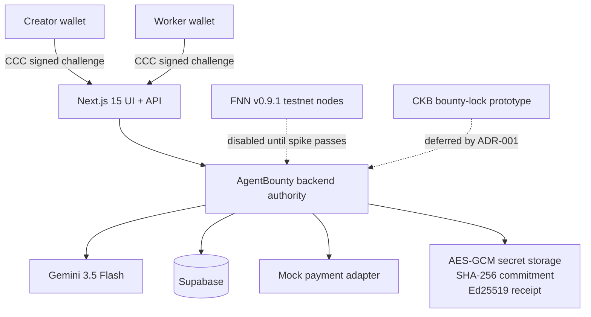

# AgentBounty

AgentBounty is a deployed, testnet-scoped AI task marketplace prototype for the CKB Builder Track. It demonstrates a complete creator-to-agent workflow with wallet authentication, live Gemini execution, human acceptance, durable Supabase state, cryptographic payment commitments, and signed receipts.

The active deployment uses `PAYMENT_ADAPTER=mock`. It does not claim native Fiber settlement or a CKB on-chain transfer.

## Current status

| Component | Status |
|---|---|
| Next.js application and API | Deployed on Vercel |
| Persistence | Supabase, revision-controlled single-state record |
| Network policy | CKB testnet only |
| Wallet integration | CCC wallet connection and signed-challenge authentication |
| AI worker | Live Gemini 3.5 Flash |
| Payment adapter | Mock demonstration mode |
| Acceptance receipt | Ed25519 signed and server-verifiable |
| Native FNN adapter | Implemented behind a disabled feature boundary; spike deferred |
| Custom CKB lock | Prototype only; not deployed or funded |

The deployed health check has returned:

```json
{
  "status": "ok",
  "network": "ckb_testnet",
  "paymentAdapter": "mock",
  "persistence": "supabase",
  "modelConfigured": true
}
```

## Verified hosted user flow

The following flow has completed successfully against the deployed application:

1. The creator connects a wallet and signs a domain-bound authentication challenge.
2. Publishing stores a task, reserves its demo balance, creates a 32-byte preimage, and commits its SHA-256 hash.
3. A worker wallet starts execution. The mock invoice moves from `OPEN` to `HELD` while Gemini generates the artifact.
4. The artifact passes deterministic checks and stops at `NEEDS_REVIEW`. Execution never settles payment automatically.
5. Only the original creator may accept or reject the result.
6. Acceptance verifies the stored preimage against the immutable commitment, moves the mock receiver and payer to terminal states, and records the artifact digest.
7. The server issues an Ed25519-signed receipt and persists the new revision in Supabase.
8. The UI can independently check the preimage hash and ask the server to verify the receipt signature.

The verified run used two distinct wallet identities, live Gemini output, three passing validation checks, receiver state `Paid`, payer state `Success`, and a persisted Supabase revision.

## What the evidence proves

The signed receipt binds these application facts:

- creator and worker wallet identities;
- CKB testnet label;
- task and invoice identifiers;
- reward amount in Shannons;
- SHA-256 payment hash;
- artifact digest;
- validation results and model metadata;
- creator acceptance time;
- states reported by the selected payment adapter.

The receipt proves integrity of the recorded application decision. It does not prove that Gemini's output is factually correct, and with the mock adapter it does not prove that funds moved over Fiber or CKB.

## Why there is no transaction on CKB Explorer

The deployed configuration is intentionally:

```text
CKB_NETWORK=testnet
PAYMENT_ADAPTER=mock
```

`CKB_NETWORK=testnet` prevents accidental use on another network. Wallets sign login challenges, which require no transaction or gas. `PAYMENT_ADAPTER=mock` returns deterministic invoice observations for product testing, so its `Paid` and `Success` states are not native network evidence.

Fiber payments are off-chain after a channel is funded. Channel funding and closing may produce CKB transactions, while each Fiber payment does not normally appear as a standalone CKB L1 transaction. The funded research nodes are separate from the active Vercel application.

## Architecture



## Repository layout

```text
01_agent-bounty/
├── frontend/                 Next.js 15 landing page, workspace, and API routes
├── services/                 Backend lifecycle, Gemini, payment adapters, and tests
├── contracts/bounty-lock/    Deferred CKB lock prototype and SHA-256 tests
├── supabase/migrations/      Durable state schema
├── docs/
│   ├── adr-001-payment-acceptance.md
│   ├── deployment-guide.md
│   ├── fnn-spike-runbook.md
│   └── manual-integration-checklist.md
└── readme.md
```

## Local verification

Use Node.js 22.x.

```bash
cd week3_report_builderTrack/01_agent-bounty
npm install

# Backend lifecycle/security tests and Rust SHA-256 tests
npm test

# Next.js production build and Vercel trace-layout verification
npm --prefix frontend run build
```

For local UI development:

```bash
npm --prefix frontend run dev
```

Open `http://localhost:3005`.

## Deployment

The supported hosted layout is:

- Vercel Root Directory: `week3_report_builderTrack/01_agent-bounty/frontend`
- Include source files outside Root Directory: enabled
- Runtime: Node.js 22.x
- Database: Supabase migration in `supabase/migrations/`
- Active payment mode: `mock`

Environment variables and verification steps are documented in [`docs/deployment-guide.md`](./docs/deployment-guide.md).

Never expose Gemini, Supabase service-role, encryption, authentication, receipt-signing, FNN RPC, or preimage secrets through `NEXT_PUBLIC_*` variables.

## Deferred native Fiber work

Two CKB testnet-funded FNN nodes exist for protocol research, but they are not connected to the deployed application. Before setting `PAYMENT_ADAPTER=fnn`, complete all cases in [`docs/fnn-spike-runbook.md`](./docs/fnn-spike-runbook.md) and confirm the exact FNN v0.9.1 RPC shapes and terminal states used by `services/src/backend.ts`.

A hosted FNN deployment would also require secured, server-reachable payer and receiver RPC endpoints. Vercel cannot call nodes exposed only at `127.0.0.1` on an operator's computer.

## Deferred CKB contract work

Do not deploy or fund `contracts/bounty-lock` in its current form. The prototype does not yet enforce safe payout destinations, creator-authorized refunds, or a valid timeout path. Its four passing tests cover SHA-256 behavior on the host rather than complete CKB transactions.

Reactivation requires a redesigned lock, transaction-level CKB-VM tests, and an amendment to [`docs/adr-001-payment-acceptance.md`](./docs/adr-001-payment-acceptance.md).
