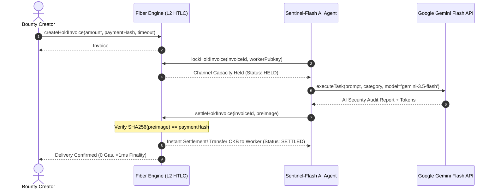

# AgentBounty Services: Fiber Hold Invoice Engine & Gemini Flash AI Worker

This sub-module powers the off-chain Layer 2 execution layer of **AgentBounty**, combining **Fiber Network Hold Invoices** (HTLC conditional payment) with autonomous **Google Gemini Flash** AI agents.

---

## Architecture & Component Overview



---

## Key Components

### 1. `FiberHoldInvoiceEngine` ([`src/fiber_engine.ts`](./src/fiber_engine.ts))
- **`createHoldInvoice`**: Registers a conditional invoice with target payment hash $H = \text{SHA-256}(P)$.
- **`lockHoldInvoice`**: Isolates creator's channel capacity off-chain into HTLC escrow upon worker pickup.
- **`settleHoldInvoice`**: Instant, zero-gas settlement upon verifying the 32-byte cryptographic preimage.
- **`cancelHoldInvoice`**: Reclaims 100% capacity back to the creator if the task times out or is rejected.

### 2. `GeminiFlashClient` ([`src/gemini_client.ts`](./src/gemini_client.ts))
- Configured to use the latest high-speed, cost-efficient **Gemini 3.5+ Flash** model (`gemini-3.5-flash`).
- Reads `GEMINI_API_KEY` and `GEMINI_MODEL` from `.env`.
- Generates a cryptographically secure 32-byte secret preimage $P$ and its hash $H$.
- Includes a built-in local autonomous security engine fallback for offline development and testing.

### 3. `AutonomousAIWorker` ([`src/ai_worker.ts`](./src/ai_worker.ts))
- Autonomous agent persona (`SecuritySentinel-Flash AI`) that automates:
  1. Task discovery & channel lock.
  2. Prompt dispatch to Gemini Flash.
  3. Preimage release to the Fiber channel.

---

## Running the Verification Simulation

```bash
# Install dependencies
npm install

# Run comprehensive E2E simulation
npm test
```

### Verified Scenarios:
1. **Happy Path**: Real Gemini Flash task execution -> Preimage verification -> Sub-second zero-gas settlement.
2. **Fraud Defense**: Malicious preimage injection is cryptographically rejected by the Fiber engine.
3. **Timeout Protection**: Expired task triggers automatic capacity refund back to creator.
