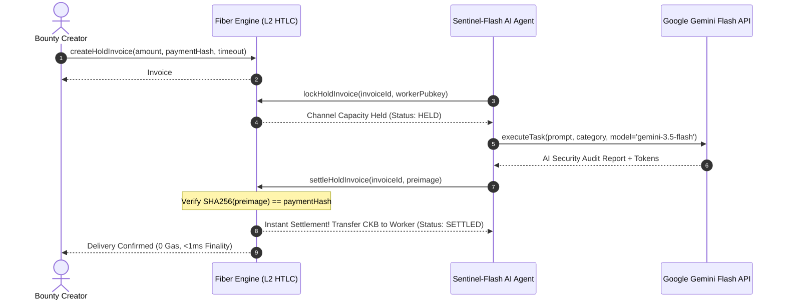

# AgentBounty Services: Fiber Hold Invoice Engine & Gemini Flash AI Worker

This sub-module powers the off-chain Layer 2 execution layer of **AgentBounty**, combining **Fiber Network Hold Invoices** (HTLC conditional payment) with autonomous **Google Gemini Flash** AI agents.

---

## Architecture & Component Overview



---

## Key Components

### 1. `FiberHoldInvoiceEngine` ([`src/fiber_engine.ts`](./src/fiber_engine.ts))
- **`createHoldInvoice`**: Registers a conditional invoice with target payment hash $H = \text{SHA-256}(P)$.
- **`lockHoldInvoice`**: Isolates creator's channel capacity off-chain into HTLC escrow upon worker pickup.
- **`settleHoldInvoice`**: Instant, zero-gas settlement upon verifying the 32-byte cryptographic preimage.
- **`cancelHoldInvoice`**: Reclaims 100% capacity back to the creator if the task times out or is rejected.

### 2. `GeminiFlashClient` ([`src/gemini_client.ts`](./src/gemini_client.ts))
- Configured to use the latest high-speed, cost-efficient **Gemini 3.5+ Flash** model (`gemini-3.5-flash`).
- Reads `GEMINI_API_KEY` and `GEMINI_MODEL` from `.env`.
- Generates a cryptographically secure 32-byte secret preimage $P$ and its hash $H$.
- Includes a built-in local autonomous security engine fallback for offline development and testing.

### 3. `AutonomousAIWorker` ([`src/ai_worker.ts`](./src/ai_worker.ts))
- Autonomous agent persona (`SecuritySentinel-Flash AI`) that automates:
  1. Task discovery & channel lock.
  2. Prompt dispatch to Gemini Flash.
  3. Preimage release to the Fiber channel.

---

## Running the Verification Simulation

```bash
# Install dependencies
npm install

# Run comprehensive E2E simulation
npm test
```

### Verified Scenarios:
1. **Happy Path**: Real Gemini Flash task execution -> Preimage verification -> Sub-second zero-gas settlement.
2. **Fraud Defense**: Malicious preimage injection is cryptographically rejected by the Fiber engine.
3. **Timeout Protection**: Expired task triggers automatic capacity refund back to creator.

---

## Phase 0 implementation-status note (14 September 2026)

`npm test` was re-run on this date: all three scenarios complete and log success. The following corrections apply to the telemetry and scenario labels above:

- The engine is an **in-memory simulation** (`Map` objects, synthetic `fnn_inv_*` / `fnn_chan_*` IDs). No FNN JSON-RPC call is made; "multi-hop off-chain channels" do not exist in this code.
- "Fraud defense" asserts only that a wrong preimage fails a local SHA-256 comparison. It does not test double-settlement, concurrent claims, restart recovery, or unknown-payment outcomes.
- "Timeout protection" is a **manually invoked** `cancelHoldInvoice`, not elapsed-time enforcement. There is no timelock, no expiry check, and no authorization check on who cancels.
- "Sub-second settlement" and "0.00 gas" are local `Date.now()` timings around map mutations, not inference, routing, or confirmation measurements.
- The Gemini fallback emits a generic template report that can settle a task; live tasks must fail visibly instead (tracked for the Phase 1 worker adapter).
- The `execute-agent` API route overwrites an invoice's payment hash to match a newly generated secret; commitments must become immutable in Phase 1 (tracked in the ADR).

## Integrated backend authority (15 September 2026)

`src/backend.ts` is now the backend used by Next.js. It provides atomic local files and revision-checked Supabase persistence, integer-Shannon accounting, strict task input validation, encrypted server-side preimages, immutable SHA-256 commitments, operation idempotency, serialized claims, artifact checks, explicit human acceptance/rejection, signed Ed25519 receipts, separate task/payment states, request timelines, a mock adapter, and a provisional FNN v0.9.1 RPC adapter.

The frontend imports this package through `file:../services`; its `predev` and `prebuild` scripts compile the service first. `npm test` runs lifecycle regression tests. The old `fiber_engine.ts`, `gemini_client.ts`, and `simulate_bounty.ts` are retained only behind `npm run check:legacy-simulation`; they are not used by the application.

The FNN adapter cannot be called safely until `docs/fnn-spike.sh` is completed against two funded testnet nodes and its observed RPC shapes are confirmed. Keep `PAYMENT_ADAPTER=mock` until then.
