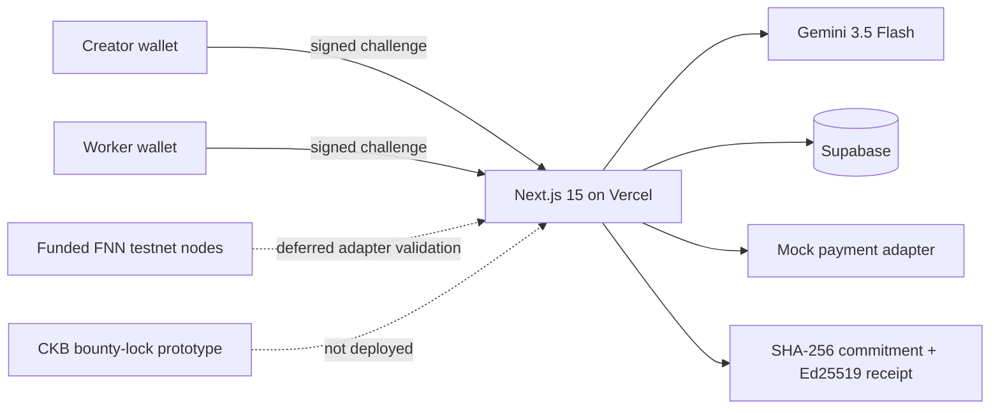

# Week 3 Builder Track Report

**Builder:** Riko Kurnia Sandi

**Track:** CKB Builder Track

**Focus:** AI agent workflows, verifiable application receipts, and testnet payment research on Nervos CKB

## Project

### 01 — AgentBounty

AgentBounty is a deployed AI task marketplace prototype. A creator publishes a bounty with a CKB-denominated demo reward, a wallet-authenticated worker runs a live Gemini agent, deterministic checks gate the result, and the creator accepts or rejects it. Acceptance reveals the committed preimage and produces an Ed25519-signed receipt.

[Open the AgentBounty report and source](./01_agent-bounty/readme.md)

## Verified deployed state

The hosted Next.js 15 application and API run together on Vercel, with durable state stored in Supabase. The deployed health endpoint has been verified with:

```json
{
  "status": "ok",
  "network": "ckb_testnet",
  "paymentAdapter": "mock",
  "persistence": "supabase",
  "modelConfigured": true
}
```

An end-to-end hosted lifecycle has also completed successfully:

1. A creator authenticated by signing a wallet challenge.
2. The creator published a bounty and immutable SHA-256 payment commitment.
3. A second wallet authenticated as the worker.
4. Gemini 3.5 Flash returned a live artifact.
5. All three deterministic validation checks passed.
6. The creator accepted the result.
7. The mock invoice reached receiver `Paid` and payer `Success` states.
8. The app issued a signed acceptance receipt and persisted the updated state in Supabase.

## Evidence boundaries

| Capability | Current evidence |
|---|---|
| Wallet identity | Real CKB-compatible wallet message signing |
| AI execution | Live Gemini 3.5 Flash response with model metadata |
| Application state | Durable Supabase row with revision-controlled updates |
| Payment commitment | Server-generated 32-byte preimage with immutable SHA-256 hash |
| Acceptance record | Ed25519-signed receipt with artifact digest and validation results |
| Payment lifecycle | Honest `PAYMENT_ADAPTER=mock` simulation |
| Native Fiber payment | Deferred; the deployed app does not call FNN nodes |
| CKB on-chain transaction | None is created by the deployed app |
| Custom `bounty-lock` | Research prototype only; not deployed or funded |

`network: ckb_testnet` is a runtime safety guard and receipt label. It does not mean the mock payment produced an on-chain transaction. Wallet signatures authenticate users without spending CKB.

## Current architecture



## Verification commands

```bash
cd week3_report_builderTrack/01_agent-bounty

# Backend lifecycle, authorization, persistence, and receipt tests
npm test

# Production frontend build, including the Vercel trace-layout guard
npm --prefix frontend run build
```

The Rust test suite currently verifies four standalone SHA-256 vectors on the host. It is not a CKB-VM transaction test suite.

## Remaining protocol work

Native Fiber activation remains a separate research gate. The two funded FNN nodes must complete the cases in [`docs/fnn-spike-runbook.md`](./01_agent-bounty/docs/fnn-spike-runbook.md), including terminal state observation, restart recovery, cancellation behavior, and the protocol expiry case. The deployed application must remain on `PAYMENT_ADAPTER=mock` until those observations match the adapter.

The custom CKB lock must not hold funds until payout destination constraints, creator refund authorization, an enforced `since` timeout, and transaction-level CKB-VM tests are added. See [`docs/adr-001-payment-acceptance.md`](./01_agent-bounty/docs/adr-001-payment-acceptance.md).
