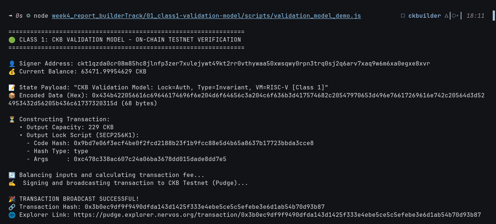

# 🛡️ 01 - CKB Script Course: Validation Model (Class 1)

> **Deep Dive into the CKB-VM Validation Model, Cell Model Verification, and Lock vs. Type Script Separation**  
> Documentation and live testnet verification of CKB's off-chain computation and on-chain validation paradigm.

---

## 🌟 Executive Summary

In traditional smart contract platforms (such as the Ethereum Virtual Machine), smart contracts operate on an **execution model**: transactions submit function call inputs, and on-chain nodes re-execute arbitrary state transition logic, modifying contract storage on-chain.

**Nervos CKB** takes a radically different, highly scalable approach based on the **generalized UTXO (Cell) model** and a pure **Validation Model**:
1. **Off-Chain Computation, On-Chain Verification**: Applications compute new states off-chain. The transaction explicitly specifies the exact state transitions: which cells are destroyed (**inputs**) and which cells are created (**outputs**).
2. **Determinism & Invariant Checks**: The on-chain **CKB-VM** (RISC-V hardware architecture) acts purely as an invariant validator. Scripts return exit code `0` for valid state transitions, or non-zero to immediately reject the transaction.
3. **Orthogonal Script Roles**:
   - **Lock Script**: Governs **Ownership & Authentication**. Executed for every input cell in the transaction. Verifies if the transaction has authorization to consume/destroy the cell (e.g. SECP256K1 signature, multi-sig, or custom logic).
   - **Type Script**: Governs **State Invariants & Business Logic**. Executed for input and output cells sharing the same type script. Ensures valid token issuance, state transitions, and contract rules (e.g. sUDT, Spore DOBs, Nervos DAO).

In this practical module, we constructed and broadcasted a transaction to the **CKB Public Testnet (Pudge)**, validating the creation of a cell storing state data constrained by the Cell Model capacity formula ($1 \text{ byte} = 1 \text{ CKB}$).

---

## 🔗 On-Chain Testnet Verification Proof

| Parameter | Value / Details |
| :--- | :--- |
| **Network** | CKB Public Testnet (Pudge) |
| **Transaction Hash** | [`0x9b8d39639d6a70064f13a609f3a7a81bba460b25ec8cd707afb53292a42ea863`](https://pudge.explorer.nervos.org/transaction/0x9b8d39639d6a70064f13a609f3a7a81bba460b25ec8cd707afb53292a42ea863) |
| **Block Number** | `22,499,978` (`0x157568a`) |
| **Block Hash** | `0x4c0d7166d6ab327f6610034fa4bd35771b26c79553e80672b7751f6fd462ae54` |
| **Sender / Signer Address** | `ckt1qzda0cr08m85hc8jlnfp3zer7xulejywt49kt2rr0vthywaa50xwsqwy0rpn3trq0sj2q6arv7xaq9w6m6xa0egxe8xvr` |
| **Cycles Consumed** | `1,623,622` (`0x18c646`) |
| **Transaction Fee** | `798 Shannons` (`0.00000798 CKB`) |
| **Status** | 🟢 `committed` |
| **Explorer Link** | [🔍 Inspect Transaction on CKB Explorer](https://pudge.explorer.nervos.org/transaction/0x9b8d39639d6a70064f13a609f3a7a81bba460b25ec8cd707afb53292a42ea863) |

---

## 📸 Screenshots & Proof of Work



---

## ⚙️ Step-by-Step Practical Execution

### 1. Understanding Script Execution Anatomy
When this transaction was submitted to the CKB node:
1. **Input Resolution**: The node loaded input cell `0x0c1af429...5ed0` (index 1).
2. **Lock Script Execution**: The input cell was locked with the standard SECP256K1-BLAKE160 lock script:
   - `code_hash`: `0x9bd7e06f3ecf4be0f2fcd2188b23f1b9fcc88e5d4b65a8637b17723bbda3cce8`
   - `hash_type`: `type`
   - `args`: `0xc478c338ac607c24a06ba3678dd015dade8dd7e5` (BLAKE160 public key hash)
3. **Witness Verification**: CKB-VM verified the cryptographic signature in the transaction `witnesses` against the lock `args`. Since the signature was valid, the script exited with return code `0`.
4. **State Commitment**: Output #0 was committed with 68 bytes of state data:
   - Text: `"CKB Validation Model: Lock=Auth, Type=Invariant, VM=RISC-V [Class 1]"`
   - Capacity: `129.0 CKB` (covering 61 bytes base cell overhead + 68 bytes data).

---

## 💻 Terminal Execution Output

```text
=================================================================
🟢 CLASS 1: CKB VALIDATION MODEL - ON-CHAIN TESTNET VERIFICATION
=================================================================

👤 Signer Address: ckt1qzda0cr08m85hc8jlnfp3zer7xulejywt49kt2rr0vthywaa50xwsqwy0rpn3trq0sj2q6arv7xaq9w6m6xa0egxe8xvr
💰 Current Balance: 64558.99960258 CKB

📝 State Payload: "CKB Validation Model: Lock=Auth, Type=Invariant, VM=RISC-V [Class 1]"
📦 Encoded Data (Hex): 0x434b422056616c69646174696f6e204d6f64656c3a204c6f636b3d417574682c20547970653d496e76617269616e742c20564d3d524953432d56205b436c61737320315d (68 bytes)

⏳ Constructing Transaction:
   • Output Capacity: 129.00000000 CKB
   • Output Lock Script (SECP256K1):
     - Code Hash: 0x9bd7e06f3ecf4be0f2fcd2188b23f1b9fcc88e5d4b65a8637b17723bbda3cce8
     - Hash Type: type
     - Args     : 0xc478c338ac607c24a06ba3678dd015dade8dd7e5

🔄 Balancing inputs and calculating transaction fee...
✍️  Signing and broadcasting transaction to CKB Testnet (Pudge)...

🎉 TRANSACTION BROADCAST SUCCESSFUL!
🔗 Transaction Hash: 0x9b8d39639d6a70064f13a609f3a7a81bba460b25ec8cd707afb53292a42ea863
🌐 Explorer Link: https://pudge.explorer.nervos.org/transaction/0x9b8d39639d6a70064f13a609f3a7a81bba460b25ec8cd707afb53292a42ea863

✅ Transaction committed on-chain in block: 22499978 (0x157568a)
   Block Hash: 0x4c0d7166d6ab327f6610034fa4bd35771b26c79553e80672b7751f6fd462ae54
   Cycles: 1623622
```

---

## 🚀 Reproduction Guide

```bash
# Navigate to the week4 root
cd week4_report_builderTrack

# Run the Class 1 practical script
node 01_class1-validation-model/scripts/validation_model_demo.js
```
