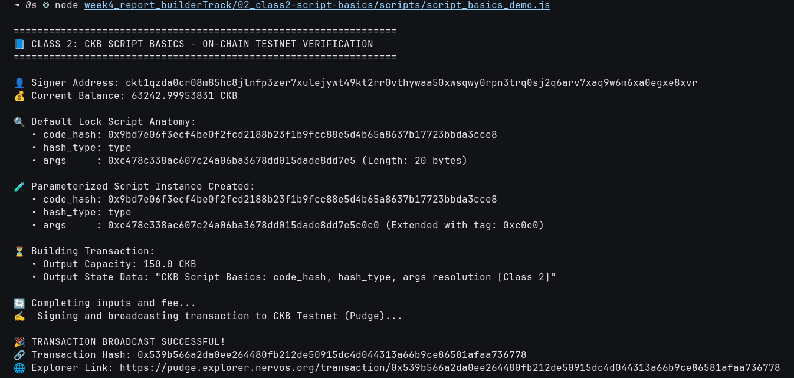

# 📜 02 - CKB Script Course: Script Basics (Class 2)

> **Understanding Script Anatomy (`code_hash`, `hash_type`, `args`), Cell Deps Resolution, and RISC-V Syscalls**  
> Practical implementation of parameterized script instances and on-chain testnet verification.

---

## 🌟 Executive Summary

In Nervos CKB, a **Script** is not an account or a separate entity stored in isolation. It is a lightweight data structure composed of three fundamental fields:

```text
┌────────────────────────────────────────────────────────┐
│                      CKB Script                        │
├───────────┬────────────────────────────────────────────┤
│ code_hash │ 32-byte cryptographic identifier           │
│ hash_type │ "data" | "data1" | "data2" | "type"        │
│ args      │ Arbitrary parameter bytes (variable size)  │
└───────────┴────────────────────────────────────────────┘
```

### 1. `code_hash` & `hash_type` Resolution
- **`hash_type: "data"` / `"data1"` / `"data2"`**: The node matches `code_hash` directly against the BLAKE2b hash of the cell data in `cell_deps`.
- **`hash_type: "type"`**: The node matches `code_hash` against the **Type Script Hash** of a cell in `cell_deps`. This critical feature enables **Type ID**, allowing smart contracts to be upgraded while maintaining a permanent, immutable script identity.

### 2. `args` (Dynamic Script Parameters)
The `args` field passes parameters to the script at runtime. Inside the CKB-VM RISC-V environment, the script accesses its arguments via the `ckb_load_script` syscall. This allows a single compiled binary (like the SECP256K1 lock) to secure millions of distinct accounts simply by passing each user's 20-byte public key hash into `args`.

### 3. `cell_deps` (Dependency Resolution)
CKB transactions separate code storage from execution. Smart contract binaries live inside ordinary cells on the blockchain. When a transaction executes a script, it includes a `cell_deps` array containing `OutPoint` references to those code cells.

---

## 🔗 On-Chain Testnet Verification Proof

| Parameter | Value / Details |
| :--- | :--- |
| **Network** | CKB Public Testnet (Pudge) |
| **Transaction Hash** | [`0x2e49f3e728d804823e0b2d8dd69eebfb954b3fb395cc7dae3689c36a19cb72a4`](https://pudge.explorer.nervos.org/transaction/0x2e49f3e728d804823e0b2d8dd69eebfb954b3fb395cc7dae3689c36a19cb72a4) |
| **Block Number** | `22,501,010` (`0x1575692`) |
| **Block Hash** | `0xfebba696b0809203c88d8125b63e5802a890a560e3a95017169580889375cbbb` |
| **Signer Address** | `ckt1qzda0cr08m85hc8jlnfp3zer7xulejywt49kt2rr0vthywaa50xwsqwy0rpn3trq0sj2q6arv7xaq9w6m6xa0egxe8xvr` |
| **Parameterized Lock Args** | `0xc478c338ac607c24a06ba3678dd015dade8dd7e5c0c0` |
| **Output Capacity** | `150.0 CKB` |
| **Status** | 🟢 `committed` |
| **Explorer Link** | [🔍 Inspect Transaction on CKB Explorer](https://pudge.explorer.nervos.org/transaction/0x2e49f3e728d804823e0b2d8dd69eebfb954b3fb395cc7dae3689c36a19cb72a4) |

---

## 📸 Screenshots & Proof of Work



---

## ⚙️ Step-by-Step Practical Execution

1. **Script Inspection**: Loaded the signer's standard SECP256K1 lock script:
   - `code_hash`: `0x9bd7e06f3ecf4be0f2fcd2188b23f1b9fcc88e5d4b65a8637b17723bbda3cce8`
   - `hash_type`: `type`
   - `args`: `0xc478c338ac607c24a06ba3678dd015dade8dd7e5` (20 bytes)
2. **Parameterized Script Creation**: Created a customized script instance by appending a 2-byte domain tag (`0xc0c0`):
   - Resulting `args`: `0xc478c338ac607c24a06ba3678dd015dade8dd7e5c0c0` (22 bytes).
3. **Transaction Assembly & Broadcast**:
   - Created an output cell with capacity `150.0 CKB` locked by the parameterized script instance.
   - Encoded state data: `"CKB Script Basics: code_hash, hash_type, args resolution [Class 2]"`.
   - Completed inputs, calculated fee, signed, and broadcasted to CKB Testnet (Pudge).

---

## 💻 Terminal Execution Output

```text
=================================================================
📘 CLASS 2: CKB SCRIPT BASICS - ON-CHAIN TESTNET VERIFICATION
=================================================================

👤 Signer Address: ckt1qzda0cr08m85hc8jlnfp3zer7xulejywt49kt2rr0vthywaa50xwsqwy0rpn3trq0sj2q6arv7xaq9w6m6xa0egxe8xvr
💰 Current Balance: 64429.9995946 CKB

🔍 Default Lock Script Anatomy:
   • code_hash: 0x9bd7e06f3ecf4be0f2fcd2188b23f1b9fcc88e5d4b65a8637b17723bbda3cce8
   • hash_type: type
   • args     : 0xc478c338ac607c24a06ba3678dd015dade8dd7e5 (Length: 20 bytes)

🧪 Parameterized Script Instance Created:
   • code_hash: 0x9bd7e06f3ecf4be0f2fcd2188b23f1b9fcc88e5d4b65a8637b17723bbda3cce8
   • hash_type: type
   • args     : 0xc478c338ac607c24a06ba3678dd015dade8dd7e5c0c0 (Extended with tag: 0xc0c0)

⏳ Building Transaction:
   • Output Capacity: 150.0 CKB
   • Output State Data: "CKB Script Basics: code_hash, hash_type, args resolution [Class 2]"

🔄 Completing inputs and fee...
✍️  Signing and broadcasting transaction to CKB Testnet (Pudge)...

🎉 TRANSACTION BROADCAST SUCCESSFUL!
🔗 Transaction Hash: 0x2e49f3e728d804823e0b2d8dd69eebfb954b3fb395cc7dae3689c36a19cb72a4
🌐 Explorer Link: https://pudge.explorer.nervos.org/transaction/0x2e49f3e728d804823e0b2d8dd69eebfb954b3fb395cc7dae3689c36a19cb72a4

⏳ Waiting for on-chain confirmation...
...
✅ Transaction committed on-chain!
   • Block Number: 22501010 (0x1575692)
   • Block Hash  : 0xfebba696b0809203c88d8125b63e5802a890a560e3a95017169580889375cbbb

🏁 Class 2 Practical Execution Complete!
```

---

## 🚀 Reproduction Guide

```bash
# Navigate to the week4 root
cd week4_report_builderTrack

# Run the Class 2 script
node 02_class2-script-basics/scripts/script_basics_demo.js
```
