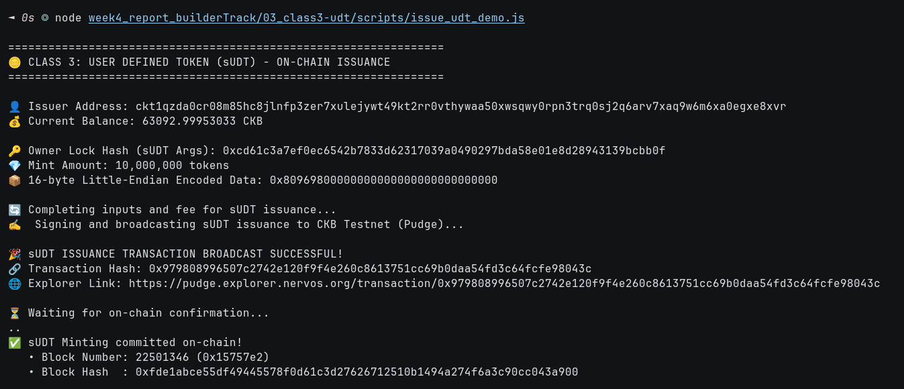

# 🪙 03 - CKB Script Course: User Defined Tokens (Class 3)

> **Understanding the Simple UDT Standard (sUDT - RFC 0025), First-Class Token Architecture, and On-Chain Minting Validation**  
> Hands-on issuance of 10,000,000 sUDT tokens with 128-bit little-endian serialization on CKB Testnet.

---

## 🌟 Executive Summary

On account-based blockchains like Ethereum, tokens (ERC-20) are stored in a centralized, monolithic contract storage table:
```solidity
mapping(address => uint256) public balances;
```
This design creates severe bottlenecks, reentrancy vulnerabilities, state bloat, and race conditions where every user's token transaction must contend for access to the single contract address.

On **Nervos CKB**, tokens are implemented using the **Simple User Defined Token (sUDT - RFC 0025)** specification, making them **first-class citizens**:
1. **Tokens Live in User Cells**: Each user's tokens are stored directly in cells owned by their own Lock Script. There is no central contract storage table.
2. **Type Script Defines Token Rules**: The sUDT Type Script acts as the minting and transfer validator:
   - `code_hash`: `0xc5e5dcf215925f7ef4dfaf5f4b4f105bc321c02776d6e7d52a1db3fcd9d011a4` (Testnet sUDT script)
   - `hash_type`: `type`
   - `args`: **Owner Lock Script Hash** (the 32-byte BLAKE2b hash of the issuer's lock script).
3. **Data Layout (16-Byte `u128`)**: The first 16 bytes of the cell's `outputs_data` contain the token amount encoded as a 128-bit unsigned integer in **Little-Endian** format (`u128`).
4. **Conservation Invariant**:
   - If the transaction input includes a cell locked by the Owner Lock, the transaction is recognized as **issuance (minting)**, allowing new tokens to be created.
   - For all other transactions (transfers), the script strictly enforces:
     $$\sum \text{Amount}_{\text{inputs}} \ge \sum \text{Amount}_{\text{outputs}}$$

---

## 🔗 On-Chain Testnet Verification Proof

| Parameter | Value / Details |
| :--- | :--- |
| **Network** | CKB Public Testnet (Pudge) |
| **Transaction Hash** | [`0x11814b0e26806983e5fe5bee4f7824ef2094fb08e57c1f880af15fd25796d6f0`](https://pudge.explorer.nervos.org/transaction/0x11814b0e26806983e5fe5bee4f7824ef2094fb08e57c1f880af15fd25796d6f0) |
| **Block Number** | `22,501,025` (`0x15756a1`) |
| **Block Hash** | `0x2d1f5094756f5d3fc6ba3f336f7c789f0c024cadf3c0e5dba95b18e5e2b3a139` |
| **Issuer Address** | `ckt1qzda0cr08m85hc8jlnfp3zer7xulejywt49kt2rr0vthywaa50xwsqwy0rpn3trq0sj2q6arv7xaq9w6m6xa0egxe8xvr` |
| **Owner Lock Hash (sUDT Args)** | `0xcd61c3a7ef0ec6542b7833d62317039a0490297bda58e01e8d28943139bcbb0f` |
| **Minted Token Amount** | `10,000,000` tokens |
| **Serialized Data (u128 LE)** | `0x80969800000000000000000000000000` (16 bytes) |
| **Output Cell Capacity** | `160.0 CKB` |
| **Status** | 🟢 `committed` |
| **Explorer Link** | [🔍 Inspect Transaction on CKB Explorer](https://pudge.explorer.nervos.org/transaction/0x11814b0e26806983e5fe5bee4f7824ef2094fb08e57c1f880af15fd25796d6f0) |

---

## 📸 Screenshots & Proof of Work



---

## ⚙️ Step-by-Step Practical Execution

1. **Calculate Issuer Identity**:
   - Generated the 32-byte BLAKE2b hash of the signer's SECP256K1 lock script:
     `ownerLockHash = 0xcd61c3a7ef0ec6542b7833d62317039a0490297bda58e01e8d28943139bcbb0f`.
2. **Encode Token Amount**:
   - Target amount: `10,000,000` (`0x989680` in hex).
   - Encoded into 16 bytes little-endian:
     `0x80969800000000000000000000000000`.
3. **Assemble sUDT Cell**:
   - Injected the official sUDT `cellDep` (`0xe12877ebd2c3c364dc46c5c992bcfaf4fee33fa13eebdf82c591fc9825aab769`, index 0).
   - Attached the sUDT Type Script with `args = ownerLockHash`.
   - Set output capacity to `160.0 CKB` to hold the cell overhead and token balance data.
4. **On-Chain Confirmation**:
   - Broadcasted and confirmed in block `#22,501,025` on CKB Testnet.

---

## 💻 Terminal Execution Output

```text
=================================================================
🪙 CLASS 3: USER DEFINED TOKEN (sUDT) - ON-CHAIN ISSUANCE
=================================================================

👤 Issuer Address: ckt1qzda0cr08m85hc8jlnfp3zer7xulejywt49kt2rr0vthywaa50xwsqwy0rpn3trq0sj2q6arv7xaq9w6m6xa0egxe8xvr
💰 Current Balance: 64279.99958662 CKB

🔑 Owner Lock Hash (sUDT Args): 0xcd61c3a7ef0ec6542b7833d62317039a0490297bda58e01e8d28943139bcbb0f
💎 Mint Amount: 10,000,000 tokens
📦 16-byte Little-Endian Encoded Data: 0x80969800000000000000000000000000

🔄 Completing inputs and fee for sUDT issuance...
✍️  Signing and broadcasting sUDT issuance to CKB Testnet (Pudge)...

🎉 sUDT ISSUANCE TRANSACTION BROADCAST SUCCESSFUL!
🔗 Transaction Hash: 0x11814b0e26806983e5fe5bee4f7824ef2094fb08e57c1f880af15fd25796d6f0
🌐 Explorer Link: https://pudge.explorer.nervos.org/transaction/0x11814b0e26806983e5fe5bee4f7824ef2094fb08e57c1f880af15fd25796d6f0

⏳ Waiting for on-chain confirmation...
...
✅ sUDT Minting committed on-chain!
   • Block Number: 22501025 (0x15756a1)
   • Block Hash  : 0x2d1f5094756f5d3fc6ba3f336f7c789f0c024cadf3c0e5dba95b18e5e2b3a139

🏁 Class 3 Practical Execution Complete!
```

---

## 🚀 Reproduction Guide

```bash
# Navigate to the week4 root
cd week4_report_builderTrack

# Run the sUDT issuance script
node 03_class3-udt/scripts/issue_udt_demo.js
```
