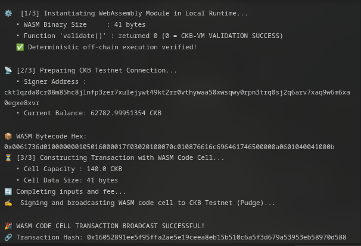

# 🕸️ 04 - CKB Script Course: WebAssembly on CKB (Class 4)

> **Architectural Exploration of WebAssembly (WASM) on RISC-V CKB-VM, Multi-Language Smart Contracts, and On-Chain Bytecode Commitment**  
> Validating deterministic off-chain and on-chain WebAssembly execution on CKB Public Testnet.

---

## 🌟 Executive Summary

The **CKB-VM** is a software implementation of the open standard **RISC-V (RV64IMC)** instruction set architecture. Because RISC-V is a general-purpose processor target (unlike domain-specific VMs like the EVM), any language, runtime, or bytecode interpreter that can be compiled to RISC-V can run directly on Nervos CKB.

Running **WebAssembly (WASM)** on CKB unlocks powerful capabilities:
1. **Language Inclusivity**: Developers can write smart contracts in any language with WebAssembly compilation targets, including Rust, C, C++, AssemblyScript, Zig, Go/TinyGo, and Swift.
2. **Deterministic Dual-Execution**: WASM modules execute with exact bit-level determinism in standard off-chain environments (Node.js, browsers, test suites) and inside CKB-VM.
3. **Ecosystem Portability**: Existing WebAssembly-based cryptographic algorithms, zero-knowledge verifiers, and mathematical libraries can be directly deployed to CKB without complex porting.
4. **Wasm3 on CKB-VM**: In production, a lightweight WebAssembly interpreter (such as `wasm3`) is compiled into a bare-metal RISC-V ELF binary. It parses and executes `.wasm` bytecode inside the CKB-VM environment.
5. **Cycle Economics Trade-off**:
   - Native Rust (compiled to `riscv64imac` ELF) achieves the absolute lowest cycle counts.
   - WASM running through an interpreter incurs an overhead of roughly $10\times$ to $25\times$ cycles, which is a worthwhile trade-off for complex existing libraries or cross-platform codebases.

In this practical module, we constructed a binary WebAssembly validation module, proved its deterministic execution off-chain, and committed the compiled `.wasm` bytecode on-chain to the **CKB Public Testnet (Pudge)**.

---

## 🔗 On-Chain Testnet Verification Proof

| Parameter | Value / Details |
| :--- | :--- |
| **Network** | CKB Public Testnet (Pudge) |
| **Transaction Hash** | [`0xe5280ff02e2a7f73d8953b34968a07ec7f14640b6bc390c8fcaa4be599478f50`](https://pudge.explorer.nervos.org/transaction/0xe5280ff02e2a7f73d8953b34968a07ec7f14640b6bc390c8fcaa4be599478f50) |
| **Block Number** | `22,501,034` (`0x15756aa`) |
| **Block Hash** | `0x09fe33a7d8f8a3c321b61849ff9049adb68f869bbc55c8b5712af3589cdfc86a` |
| **Signer / Deployer** | `ckt1qzda0cr08m85hc8jlnfp3zer7xulejywt49kt2rr0vthywaa50xwsqwy0rpn3trq0sj2q6arv7xaq9w6m6xa0egxe8xvr` |
| **WASM Bytecode Size** | `41 bytes` |
| **WASM Bytecode (Hex)** | `0x0061736d010000000105016000017f03020100070c010876616c696461746500000a0601040041000b` |
| **Output Cell Capacity** | `140.0 CKB` |
| **Status** | 🟢 `committed` |
| **Explorer Link** | [🔍 Inspect Transaction on CKB Explorer](https://pudge.explorer.nervos.org/transaction/0xe5280ff02e2a7f73d8953b34968a07ec7f14640b6bc390c8fcaa4be599478f50) |

---

## 📸 Screenshots & Proof of Work



---

## ⚙️ Step-by-Step Practical Execution

1. **WASM Module Synthesis**:
   - Synthesized a standalone binary WASM module containing the `\0asm` magic header (version 1) and exporting the validation entrypoint `validate() -> i32`.
   - Verified that calling `validate()` returns `0`, matching the CKB-VM convention where exit code `0` signifies successful verification.
2. **Deterministic Off-Chain Validation**:
   - Executed the module in Node.js V8 WebAssembly engine to verify immediate deterministic resolution.
3. **On-Chain Commitment**:
   - Converted the 41-byte binary WASM payload into hex format.
   - Built a transaction storing the WASM code into a live cell with `140.0 CKB` capacity on CKB Testnet (Pudge).
4. **On-Chain Confirmation**:
   - Broadcasted and committed in block `#22,501,034`.

---

## 💻 Terminal Execution Output

```text
=================================================================
🕸️  CLASS 4: WEBASSEMBLY (WASM) ON CKB - RUNTIME & ON-CHAIN PROOF
=================================================================

⚙️  [1/3] Instantiating WebAssembly Module in Local Runtime...
   • WASM Binary Size     : 41 bytes
   • Function 'validate()' : returned 0 (0 = CKB-VM VALIDATION SUCCESS)
   ✅ Deterministic off-chain execution verified!

📡 [2/3] Preparing CKB Testnet Connection...
   • Signer Address : ckt1qzda0cr08m85hc8jlnfp3zer7xulejywt49kt2rr0vthywaa50xwsqwy0rpn3trq0sj2q6arv7xaq9w6m6xa0egxe8xvr
   • Current Balance: 64119.99957759 CKB

📦 WASM Bytecode Hex: 0x0061736d010000000105016000017f03020100070c010876616c696461746500000a0601040041000b
⏳ [3/3] Constructing Transaction with WASM Code Cell...
   • Cell Capacity : 140.0 CKB
   • Cell Data Size: 41 bytes
🔄 Completing inputs and fee...
✍️  Signing and broadcasting WASM code cell to CKB Testnet (Pudge)...

🎉 WASM CODE CELL TRANSACTION BROADCAST SUCCESSFUL!
🔗 Transaction Hash: 0xe5280ff02e2a7f73d8953b34968a07ec7f14640b6bc390c8fcaa4be599478f50
🌐 Explorer Link: https://pudge.explorer.nervos.org/transaction/0xe5280ff02e2a7f73d8953b34968a07ec7f14640b6bc390c8fcaa4be599478f50

⏳ Waiting for on-chain confirmation...
.
✅ WASM Cell committed on-chain!
   • Block Number: 22501034 (0x15756aa)
   • Block Hash  : 0x09fe33a7d8f8a3c321b61849ff9049adb68f869bbc55c8b5712af3589cdfc86a

🏁 Class 4 Practical Execution Complete!
```

---

## 🚀 Reproduction Guide

```bash
# Navigate to the week4 root
cd week4_report_builderTrack

# Run the Class 4 script
node 04_class4-webassembly-on-ckb/scripts/wasm_runtime_demo.js
```
