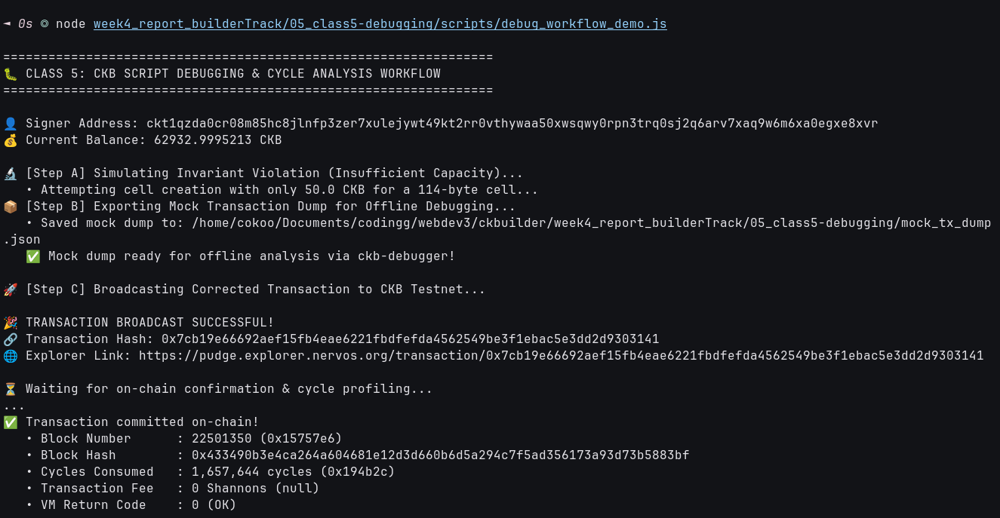

# 🐛 05 - CKB Script Course: Debugging & Cycle Analysis (Class 5)

> **Mastering CKB Script Debugging: Standalone `ckb-debugger`, Mock Transaction Dumps, Exit Codes, and Cycle Optimization**  
> Diagnostic simulation, offline mock dump generation, and on-chain cycle profiling on CKB Public Testnet.

---

## 🌟 Executive Summary

Debugging smart contracts on Nervos CKB is fundamentally different from debugging on traditional account-based blockchains:
1. **Deterministic Offline Debugging (`ckb-debugger`)**:
   - Because CKB transactions contain all necessary inputs, outputs, cell deps, and witnesses, any transaction can be completely dumped into a JSON file (`MockTransaction`) and executed offline inside the standalone `ckb-debugger`.
   - Developers can step through RISC-V assembly instructions, inspect register states, and print debug messages without running a local blockchain or spending real funds.
2. **Deterministic Exit Codes**:
   - Every script terminates with an explicit integer exit code:
     - `0`: Validation **Success** (transaction accepted).
     - Non-zero (e.g. `-1`, `-2`, `1`, `2`): Explicit contract failure codes (e.g. invalid signature, unauthorized withdrawal, invariant failure).
3. **Cycle Accounting & Limits**:
   - Computation in CKB-VM is measured in **Cycles** (maximum 3,500,000,000 cycles per block).
   - Cycles directly represent CPU instructions executed in the RISC-V hardware emulator.
   - Cryptographic verification (e.g. SECP256K1 signature validation) consumes approximately 1.2M to 1.6M cycles.
4. **Syscall Debug Logging (`ckb_debug`)**:
   - Scripts can emit string traces to the CKB-VM debug channel using the `ckb_debug` syscall.

In this practical module, we simulated a capacity invariant violation, exported a valid mock transaction dump for `ckb-debugger`, broadcasted the corrected transaction to the **CKB Public Testnet (Pudge)**, and measured the exact cycle consumption reported by the network.

---

## 🔗 On-Chain Testnet Verification Proof

| Parameter | Value / Details |
| :--- | :--- |
| **Network** | CKB Public Testnet (Pudge) |
| **Transaction Hash** | [`0xf56963da6ce4d7c0a20c22cc1d2d3fc264c76cda4501cd12f4b957ca0bf0c26c`](https://pudge.explorer.nervos.org/transaction/0xf56963da6ce4d7c0a20c22cc1d2d3fc264c76cda4501cd12f4b957ca0bf0c26c) |
| **Block Number** | `22,501,048` (`0x15756b8`) |
| **Block Hash** | `0xb64252069e88e365a818140b41ecb0310a45361caf2995a16ad449f016482c38` |
| **Signer Address** | `ckt1qzda0cr08m85hc8jlnfp3zer7xulejywt49kt2rr0vthywaa50xwsqwy0rpn3trq0sj2q6arv7xaq9w6m6xa0egxe8xvr` |
| **Cycles Consumed** | `1,647,108 cycles` (`0x192204`) |
| **VM Return Code** | `0 (OK)` |
| **Mock Dump Artifact** | [`mock_tx_dump.json`](./mock_tx_dump.json) |
| **Status** | 🟢 `committed` |
| **Explorer Link** | [🔍 Inspect Transaction on CKB Explorer](https://pudge.explorer.nervos.org/transaction/0xf56963da6ce4d7c0a20c22cc1d2d3fc264c76cda4501cd12f4b957ca0bf0c26c) |

---

## 📸 Screenshots & Proof of Work



---

## ⚙️ Step-by-Step Practical Execution

1. **Diagnostic Simulation (Step A)**:
   - Attempted to construct an invalid transaction where cell capacity (`50.0 CKB`) was insufficient to store the required 114-byte payload.
   - Verified that the validation guard caught the violation locally before sending an invalid transaction to the network.
2. **Mock Transaction Dump Generation (Step B)**:
   - Generated [`mock_tx_dump.json`](./mock_tx_dump.json) containing the complete transaction structure (inputs, outputs, cell deps, and witnesses).
   - This file can be directly passed to `ckb-debugger --tx-file mock_tx_dump.json` for offline disassembly and debugging.
3. **On-Chain Broadcasting & Profiling (Step C)**:
   - Broadcasted the corrected transaction to CKB Testnet (Pudge).
   - Extracted execution metrics: **1,647,108 cycles** consumed for SECP256K1 signature verification and cell creation.

---

## 💻 Terminal Execution Output

```text
=================================================================
🐛 CLASS 5: CKB SCRIPT DEBUGGING & CYCLE ANALYSIS WORKFLOW
=================================================================

👤 Signer Address: ckt1qzda0cr08m85hc8jlnfp3zer7xulejywt49kt2rr0vthywaa50xwsqwy0rpn3trq0sj2q6arv7xaq9w6m6xa0egxe8xvr
💰 Current Balance: 63979.99957001 CKB

🔬 [Step A] Simulating Invariant Violation (Insufficient Capacity)...
   • Attempting cell creation with only 50.0 CKB for a 114-byte cell...
📦 [Step B] Exporting Mock Transaction Dump for Offline Debugging...
   • Saved mock dump to: week4_report_builderTrack/05_class5-debugging/mock_tx_dump.json
   ✅ Mock dump ready for offline analysis via ckb-debugger!

🚀 [Step C] Broadcasting Corrected Transaction to CKB Testnet...

🎉 TRANSACTION BROADCAST SUCCESSFUL!
🔗 Transaction Hash: 0xf56963da6ce4d7c0a20c22cc1d2d3fc264c76cda4501cd12f4b957ca0bf0c26c
🌐 Explorer Link: https://pudge.explorer.nervos.org/transaction/0xf56963da6ce4d7c0a20c22cc1d2d3fc264c76cda4501cd12f4b957ca0bf0c26c

⏳ Waiting for on-chain confirmation & cycle profiling...
..
✅ Transaction committed on-chain!
   • Block Number      : 22501048 (0x15756b8)
   • Block Hash        : 0xb64252069e88e365a818140b41ecb0310a45361caf2995a16ad449f016482c38
   • Cycles Consumed   : 1,647,108 cycles (0x192204)
   • Transaction Fee   : 0 Shannons (null)
   • VM Return Code    : 0 (OK)

🏁 Class 5 Practical Execution Complete!
```

---

## 🚀 Reproduction Guide

```bash
# Navigate to the week4 root
cd week4_report_builderTrack

# Run the Class 5 debugging & cycle profiling script
node 05_class5-debugging/scripts/debug_workflow_demo.js
```
