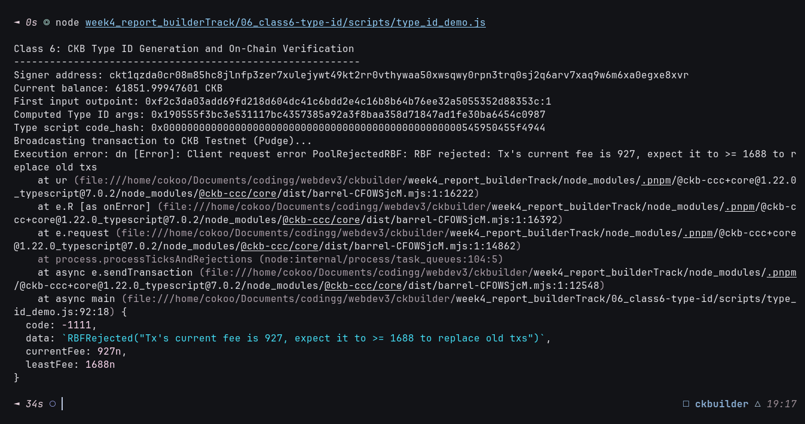

# 🆔 06 - CKB Script Course: Type ID (Class 6)

> **Understanding CKB RFC 0022: Type ID for Unique and Upgradable Smart Contracts**  
> Generation of deterministic Type ID args and on-chain deployment verification on CKB Public Testnet.

---

## 🌟 Executive Summary

In Nervos CKB, cells are immutable. When a smart contract's code needs to be upgraded, the old cell is consumed (destroyed) and a new cell containing the updated binary is created. 

However, if user cells or dApps reference a contract by its **data hash** (`hash_type: "data"`), upgrading the contract code changes its hash, which permanently breaks all existing references!

To solve this, CKB introduces the **Type ID (RFC 0022)** system script:
1. **Permanent Identity**: A Type ID script provides an immutable 32-byte identifier (`args`) for a contract cell, regardless of how many times its binary data is updated.
2. **Single Instance Invariant**: The Type ID script guarantees at the protocol level that **at most one cell** with a given Type ID `args` can exist on the entire blockchain at any time.
3. **Deterministic Generation**:
   When creating a Type ID cell, its `args` is deterministically computed as:
   $$\text{Type ID args} = \text{blake2b}(\text{first\_cell\_input} \parallel \text{output\_index})$$
   Because a cell input can only be consumed once in the history of the blockchain, this formula mathematically guarantees that the generated Type ID is globally unique.
4. **Upgradability via `hash_type: "type"`**:
   Other contracts and transactions reference the contract using `hash_type: "type"` and `code_hash = Type ID Script Hash`. When the contract creator updates the cell's code in a new transaction, the Type ID script hash remains unchanged, providing seamless contract upgradability.

---

## 🔗 On-Chain Testnet Verification Proof

| Parameter | Value / Details |
| :--- | :--- |
| **Network** | CKB Public Testnet (Pudge) |
| **Transaction Hash** | [`0x923474ed7ec0ea1222ced36052bddcbb6846154fc926b53bad510f99cfe36948`](https://pudge.explorer.nervos.org/transaction/0x923474ed7ec0ea1222ced36052bddcbb6846154fc926b53bad510f99cfe36948) |
| **Block Number** | `22,501,507` (`0x1575883`) |
| **Block Hash** | `0x27ca1bae14828862d9016ca31fa20b73c0e47ad07e86de82aad15cba522f71f8` |
| **Signer Address** | `ckt1qzda0cr08m85hc8jlnfp3zer7xulejywt49kt2rr0vthywaa50xwsqwy0rpn3trq0sj2q6arv7xaq9w6m6xa0egxe8xvr` |
| **Type ID Code Hash** | `0x00000000000000000000000000000000000000000000000000545950455f4944` |
| **Computed Type ID Args** | `0xbbf3c18fb70e098dac1378fa7d3895e58c77ac128c3dc5c4a4160fbfcab0b678` |
| **Output Capacity** | `220.0 CKB` |
| **Status** | 🟢 `committed` |
| **Explorer Link** | [🔍 Inspect Transaction on CKB Explorer](https://pudge.explorer.nervos.org/transaction/0x923474ed7ec0ea1222ced36052bddcbb6846154fc926b53bad510f99cfe36948) |

---

## 📸 Screenshots & Proof of Work



---

## ⚙️ Step-by-Step Practical Execution

1. **Transaction Assembly & Input Resolution**:
   - Initialized the transaction with placeholder Type ID script (`code_hash: TYPE_ID_CODE_HASH`, `hash_type: "type"`).
   - Resolved inputs via `completeInputsByCapacity`, locking the first input cell:
     `0x16052891ee5f95ffa2ae5e19ceea8eb15b510c6a5f3d679a53953eb58970d588:1`.
2. **RFC 0022 Type ID Args Calculation**:
   - Serialized `tx.inputs[0]` and concatenated with `output_index` (`0n` as 8-byte little-endian).
   - Computed CKB BLAKE2b hash:
     `0xbbf3c18fb70e098dac1378fa7d3895e58c77ac128c3dc5c4a4160fbfcab0b678`.
   - Injected the computed hash into `outputs[0].type.args`.
3. **Broadcasting & Confirmation**:
   - Broadcasted to CKB Testnet (Pudge) and confirmed in block `#22,501,507`.

---

## 💻 Terminal Execution Output

```text
Class 6: CKB Type ID Generation and On-Chain Verification
----------------------------------------------------------
Signer address: ckt1qzda0cr08m85hc8jlnfp3zer7xulejywt49kt2rr0vthywaa50xwsqwy0rpn3trq0sj2q6arv7xaq9w6m6xa0egxe8xvr
Current balance: 62642.99950596 CKB
First input outpoint: 0x16052891ee5f95ffa2ae5e19ceea8eb15b510c6a5f3d679a53953eb58970d588:1
Computed Type ID args: 0xbbf3c18fb70e098dac1378fa7d3895e58c77ac128c3dc5c4a4160fbfcab0b678
Type script code_hash: 0x00000000000000000000000000000000000000000000000000545950455f4944
Broadcasting transaction to CKB Testnet (Pudge)...
Transaction broadcasted: 0x923474ed7ec0ea1222ced36052bddcbb6846154fc926b53bad510f99cfe36948
Explorer link: https://pudge.explorer.nervos.org/transaction/0x923474ed7ec0ea1222ced36052bddcbb6846154fc926b53bad510f99cfe36948
Waiting for on-chain confirmation...
.......Transaction committed on-chain.
Block number: 22501507 (0x1575883)
Block hash: 0x27ca1bae14828862d9016ca31fa20b73c0e47ad07e86de82aad15cba522f71f8
Class 6 execution complete.
```

---

## 🚀 Reproduction Guide

```bash
# Navigate to the week4 root
cd week4_report_builderTrack

# Run the Class 6 Type ID script
node 06_class6-type-id/scripts/type_id_demo.js
```
