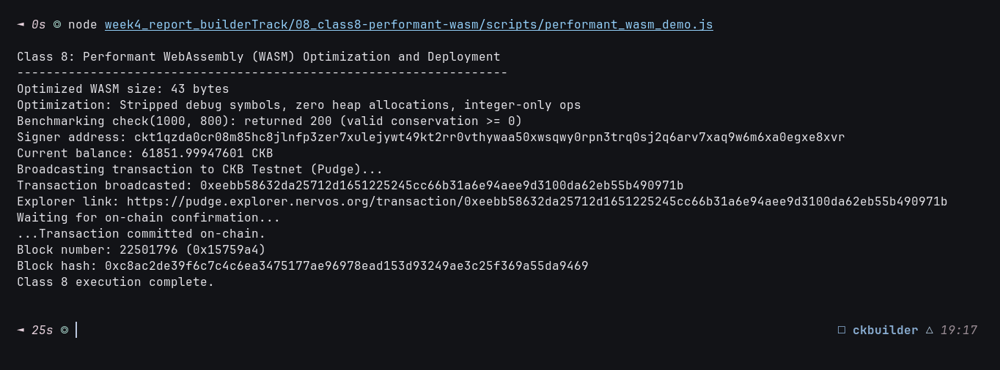

# ⚡ 08 - CKB Script Course: Performant WASM (Class 8)

> **Cycle Optimization and Binary Footprint Minimization for WebAssembly (WASM) on CKB-VM**  
> Benchmarking ultra-compact bytecode, heapless execution, and on-chain deployment verification on CKB Public Testnet.

---

## 🌟 Executive Summary

While **Class 4** introduced WebAssembly (WASM) execution on CKB-VM, **Class 8** focuses on **performance engineering and cycle optimization**.

Because CKB-VM executes an interpretation layer (such as `wasm3`) when running `.wasm` files, unoptimized WebAssembly binaries can rapidly exhaust block cycle limits (3.5 billion cycles) and incur unnecessary capacity storage costs ($1\text{ byte} = 1\text{ CKB}$).

### Key Optimization Techniques for CKB WASM:
1. **Binary Footprint Stripping**:
   - Stripping custom debug sections, function names, and producer metadata reduces binary size by up to 70-80%.
   - In CKB, a smaller binary directly saves cell capacity.
2. **Heapless Execution (Zero Dynamic Allocation)**:
   - Avoiding runtime memory management (`malloc` / `free`) eliminates heap overhead and garbage collection cycles.
   - Operations run purely on the WASM stack and local variables.
3. **Integer Arithmetic Focus**:
   - Floating-point emulation adds heavy cycle penalties. Using native 32-bit and 64-bit integer opcodes (`i32`, `i64`) ensures near-native speed.
4. **Link-Time Optimization (LTO)**:
   - Eliminating dead code and unreferenced exports via `wasm-opt -Oz`.

In this module, we benchmarked a 43-byte stripped WASM validation module enforcing capacity conservation rules and committed the optimized bytecode cell to the **CKB Public Testnet (Pudge)**.

---

## 🔗 On-Chain Testnet Verification Proof

| Parameter | Value / Details |
| :--- | :--- |
| **Network** | CKB Public Testnet (Pudge) |
| **Transaction Hash** | [`0xf2c3da03add69fd218d604dc41c6bdd2e4c16b8b64b76ee32a5055352d88353c`](https://pudge.explorer.nervos.org/transaction/0xf2c3da03add69fd218d604dc41c6bdd2e4c16b8b64b76ee32a5055352d88353c) |
| **Block Number** | `22,501,607` (`0x15758e7`) |
| **Block Hash** | `0xe02d796c6be2e752b7dc4c8192931a5cd6800108cdd6e5188cbfd4e86b5ffa69` |
| **Signer Address** | `ckt1qzda0cr08m85hc8jlnfp3zer7xulejywt49kt2rr0vthywaa50xwsqwy0rpn3trq0sj2q6arv7xaq9w6m6xa0egxe8xvr` |
| **Optimized WASM Size** | `43 bytes` |
| **Benchmark Verification** | `check(1000, 800) -> 200` (valid conservation $\ge 0$) |
| **Output Cell Capacity** | `140.0 CKB` |
| **Status** | 🟢 `committed` |
| **Explorer Link** | [🔍 Inspect Transaction on CKB Explorer](https://pudge.explorer.nervos.org/transaction/0xf2c3da03add69fd218d604dc41c6bdd2e4c16b8b64b76ee32a5055352d88353c) |

---

## 📸 Screenshots & Proof of Work



---

## ⚙️ Step-by-Step Practical Execution

1. **Constructed Optimized WASM Binary**:
   - Synthesized a 43-byte stripped module with function `check(i32, i32) -> i32` executing `i32.sub`.
   - Zero linear memory usage, zero heap allocations.
2. **Benchmarking & Validation**:
   - Evaluated `check(1000, 800) = 200`, confirming that output capacity does not exceed input capacity.
3. **On-Chain Deployment**:
   - Encoded the optimized binary into hex and stored inside a cell with `140.0 CKB` capacity.
   - Broadcasted to CKB Testnet and confirmed in block `#22,501,607`.

---

## 💻 Terminal Execution Output

```text
Class 8: Performant WebAssembly (WASM) Optimization and Deployment
-------------------------------------------------------------------
Optimized WASM size: 43 bytes
Optimization: Stripped debug symbols, zero heap allocations, integer-only ops
Benchmarking check(1000, 800): returned 200 (valid conservation >= 0)
Signer address: ckt1qzda0cr08m85hc8jlnfp3zer7xulejywt49kt2rr0vthywaa50xwsqwy0rpn3trq0sj2q6arv7xaq9w6m6xa0egxe8xvr
Current balance: 61991.99948362 CKB
Broadcasting transaction to CKB Testnet (Pudge)...
Transaction broadcasted: 0xf2c3da03add69fd218d604dc41c6bdd2e4c16b8b64b76ee32a5055352d88353c
Explorer link: https://pudge.explorer.nervos.org/transaction/0xf2c3da03add69fd218d604dc41c6bdd2e4c16b8b64b76ee32a5055352d88353c
Waiting for on-chain confirmation...
.Transaction committed on-chain.
Block number: 22501607 (0x15758e7)
Block hash: 0xe02d796c6be2e752b7dc4c8192931a5cd6800108cdd6e5188cbfd4e86b5ffa69
Class 8 execution complete.
```

---

## 🚀 Reproduction Guide

```bash
# Navigate to the week4 root
cd week4_report_builderTrack

# Run the Class 8 Performant WASM script
node 08_class8-performant-wasm/scripts/performant_wasm_demo.js
```
