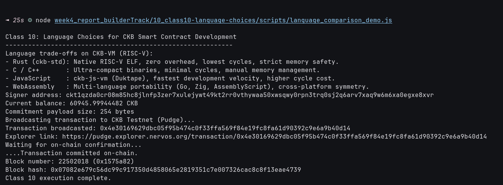

# 🌐 10 - CKB Script Course: Language Choices (Class 10)

> **Comparative Architecture, Trade-Off Analysis, and Toolchain Selection for CKB Smart Contract Languages**  
> In-depth synthesis of Rust (`ckb-std`), C/C++, JavaScript (`ckb-js-vm`), and WebAssembly (WASM) on CKB-VM (RISC-V).

---

## 🌟 Executive Summary

One of the greatest architectural strengths of **Nervos CKB** is its language-agnostic execution environment. Because the **CKB-VM** implements the open hardware standard **RISC-V (RV64IMC)**, smart contracts are simply standard ELF executables rather than domain-specific bytecode tied to a single programming language.

### Comprehensive Language Comparison Matrix

| Language / Stack | Target / Runtime | Cycle Efficiency | Binary Footprint | Memory Safety | Primary Use Cases |
| :--- | :--- | :---: | :---: | :---: | :--- |
| **Rust (`ckb-std`)** | `riscv64imac-unknown-none-elf` | 🟢 **Ultra-High** (~10k–50k cycles) | ~10 KB – 30 KB | 🟢 **Compile-Time Guaranteed** | Production DeFi protocols, xUDT, custom locks, security-critical contracts |
| **C / C++** | `riscv64-unknown-elf-gcc` / `clang` | 🟢 **Ultra-High** (~5k–20k cycles) | ~2 KB – 10 KB | 🔴 **Manual (Unsafe)** | Foundational system scripts (Secp256k1, DAO, sUDT base implementation) |
| **JavaScript (`ckb-js-vm`)** | Duktape engine on RISC-V | 🟡 **Moderate** (~1M–5M cycles) | Source / Bytecode (`.bc`) | 🟡 **Runtime Managed** | Rapid prototyping, hackathons, application validation layers, DAO logic |
| **WebAssembly (WASM)** | Wasm3 interpreter on RISC-V | 🟡 **Intermediate** (~500k–3M cycles) | Compiled `.wasm` (~40B–50KB) | 🟢 **Sandboxed** | Reusing existing WebAssembly crypto/math libraries, cross-platform symmetry |

---

## 🔗 On-Chain Testnet Verification Proof

| Parameter | Value / Details |
| :--- | :--- |
| **Network** | CKB Public Testnet (Pudge) |
| **Transaction Hash** | [`0x6fbbcbe1cecac223961651d472406e4f6d7408868bcd5a09de48b12bf2281912`](https://pudge.explorer.nervos.org/transaction/0x6fbbcbe1cecac223961651d472406e4f6d7408868bcd5a09de48b12bf2281912) |
| **Block Number** | `22,501,979` (`0x1575a5b`) |
| **Block Hash** | `0x04c5242d7a5e8088d32f91f12689416de7ed5c7c69dc04451481c819f673bb9f` |
| **Signer Address** | `ckt1qzda0cr08m85hc8jlnfp3zer7xulejywt49kt2rr0vthywaa50xwsqwy0rpn3trq0sj2q6arv7xaq9w6m6xa0egxe8xvr` |
| **Commitment Payload Size** | `254 bytes` |
| **Output Cell Capacity** | `250.0 CKB` |
| **Status** | 🟢 `committed` |
| **Explorer Link** | [🔍 Inspect Transaction on CKB Explorer](https://pudge.explorer.nervos.org/transaction/0x6fbbcbe1cecac223961651d472406e4f6d7408868bcd5a09de48b12bf2281912) |

---

## 📸 Screenshots & Proof of Work



---

## ⚙️ Step-by-Step Practical Execution

1. **Synthesized Multi-Language Architecture Commitment**:
   - Structured JSON commitment payload representing the completed 10-class curriculum:
     ```json
     {
       "course": "CKB Script Development Course",
       "completion": "Classes 1 - 10",
       "languages": ["Rust (ckb-std)", "C/C++", "JavaScript (ckb-js-vm)", "WebAssembly (WASM)"],
       "vm_target": "RISC-V (RV64IMC)",
       "validation_model": "Off-chain computation, on-chain verification"
     }
     ```
2. **On-Chain Deployment**:
   - Encoded the 254-byte payload into hex.
   - Built transaction with `250.0 CKB` capacity output cell.
   - Broadcasted to CKB Testnet (Pudge) and confirmed in block `#22,501,979`.

---

## 💻 Terminal Execution Output

```text
Class 10: Language Choices for CKB Smart Contract Development
------------------------------------------------------------
Language trade-offs on CKB-VM (RISC-V):
- Rust (ckb-std): Native RISC-V ELF, zero overhead, lowest cycles, strict memory safety.
- C / C++       : Ultra-compact binaries, minimal cycles, manual memory management.
- JavaScript    : ckb-js-vm (Duktape), fastest development velocity, higher cycle cost.
- WebAssembly   : Multi-language portability (Go, Zig, AssemblyScript), cross-platform symmetry.
Signer address: ckt1qzda0cr08m85hc8jlnfp3zer7xulejywt49kt2rr0vthywaa50xwsqwy0rpn3trq0sj2q6arv7xaq9w6m6xa0egxe8xvr
Current balance: 61260.99945559 CKB
Commitment payload size: 254 bytes
Broadcasting transaction to CKB Testnet (Pudge)...
Transaction broadcasted: 0x6fbbcbe1cecac223961651d472406e4f6d7408868bcd5a09de48b12bf2281912
Explorer link: https://pudge.explorer.nervos.org/transaction/0x6fbbcbe1cecac223961651d472406e4f6d7408868bcd5a09de48b12bf2281912
Waiting for on-chain confirmation...
....Transaction committed on-chain.
Block number: 22501979 (0x1575a5b)
Block hash: 0x04c5242d7a5e8088d32f91f12689416de7ed5c7c69dc04451481c819f673bb9f
Class 10 execution complete.
```

---

## 🚀 Reproduction Guide

```bash
# Navigate to the week4 root
cd week4_report_builderTrack

# Run the Class 10 script
node 10_class10-language-choices/scripts/language_comparison_demo.js
```
