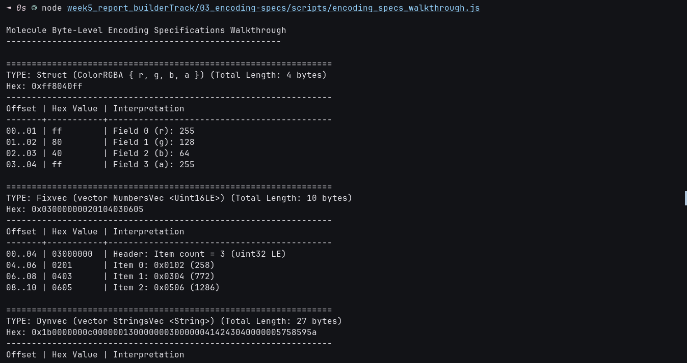

# 🔬 03 - Byte-Level Encoding Specifications & Memory Layouts

**Module**: Week 5 - Serialization Track (Lesson 17)  
**Author**: Riko Kurnia Sandi  
**Official Reference**: [Nervos Docs: Encoding Spec with Examples](https://docs.nervos.org/docs/serialization/encoding-specs) | [RFC 0008: Binary Format](https://github.com/nervosnetwork/rfcs/blob/master/rfcs/0008-serialization/0008-serialization.md)

---

## 1. Byte-Level Encoding Rules

All multi-byte numerical quantities in Molecule (total size headers, item counts, offset tables, and raw numbers) are encoded in **Little-Endian 32-bit unsigned integers (`uint32_t`)**.

### Fundamental Mathematical Rules:

1. **Table & Dynvec Header Size**:
   For any table or dynamic vector containing $N$ fields/items:
   $$\text{HeaderSize} = 4 \times (N + 1) \text{ bytes}$$
   - Byte `0..4`: Total byte length of the entire serialized object (including header and payload).
   - Byte $4 \times (i + 1) \dots 4 \times (i + 2)$: Little-endian byte offset pointing to the start of item $i$.

2. **Offset Calculation**:
   The offset of the first field ($i = 0$) is always equal to the Header Size:
   $$O_0 = 4 \times (N + 1)$$
   The offset of subsequent fields ($i > 0$) is calculated as:
   $$O_i = O_{i-1} + \text{Length}(F_{i-1})$$

---

## 2. Visual Byte Layout Maps

### A. Struct (`struct ColorRGBA { r: Uint8, g: Uint8, b: Uint8, a: Uint8 }`)
```text
┌───────────────┬───────────────┬───────────────┬───────────────┐
│     r (u8)    │     g (u8)    │     b (u8)    │     a (u8)    │
│    (1 byte)   │    (1 byte)   │    (1 byte)   │    (1 byte)   │
└───────────────┴───────────────┴───────────────┴───────────────┘
0               1               2               3               4
Total: 4 bytes (Zero header overhead)
```

### B. Fixvec (`vector NumbersVec <Uint16LE>`)
```text
┌───────────────────────────────┬───────────────┬───────────────┬───────────────┐
│       Item Count = 3          │    Item 0     │    Item 1     │    Item 2     │
│       (uint32 LE: 4B)         │  (uint16: 2B) │  (uint16: 2B) │  (uint16: 2B) │
└───────────────────────────────┴───────────────┴───────────────┴───────────────┘
0                               4               6               8               10
Total: 10 bytes
```

### C. Dynvec (`vector StringsVec <String>`)
```text
┌───────────────┬───────────────┬───────────────┬───────────────────────────────┬───────────────────────────────┐
│  Total Size   │   Offset 0    │   Offset 1    │        Item 0 Payload         │        Item 1 Payload         │
│  (0x0000001b) │  (0x0000000c) │  (0x00000013) │     (4B len + 'ABC': 7B)      │    (4B len + 'WXYZ': 8B)      │
└───────────────┴───────────────┴───────────────┴───────────────────────────────┴───────────────────────────────┘
0               4               8               12                              19                              27
```

### D. Table (`table Token { id: Uint32, symbol: String, decimals: Uint8 }`)
```text
┌───────────────┬───────────────┬───────────────┬───────────────┬───────────────┬───────────────────────────────┬───────┐
│  Total Size   │   Offset 0    │   Offset 1    │   Offset 2    │   id (uint32) │    symbol (String payload)    │  dec  │
│  (0x0000001c) │  (0x00000010) │  (0x00000014) │  (0x0000001b) │   (4 bytes)   │     (4B len + 'CKB': 7B)      │  (1B) │
└───────────────┴───────────────┴───────────────┴───────────────┴───────────────┴───────────────────────────────┴───────┘
0               4               8               12              16              20                              27      28
```

### E. Union (`union Status { Active: Uint8, Suspended: String }`)
```text
┌───────────────────────────────┬───────────────────────────────────────────────────────────────┐
│    Variant ID = 1 (uint32)    │                     Inner Payload (String)                    │
│      (0x00000001: 4 bytes)    │          (4B len = 11 + 'maintenance': 15 bytes)              │
└───────────────────────────────┴───────────────────────────────────────────────────────────────┘
0                               4                                                               19
```

---

## 3. Practical Verification Script Output

We ran [`scripts/encoding_specs_walkthrough.js`](./scripts/encoding_specs_walkthrough.js) to inspect the exact byte dumps:




```text
Molecule Byte-Level Encoding Specifications Walkthrough
------------------------------------------------------

================================================================
TYPE: Struct (ColorRGBA { r, g, b, a }) (Total Length: 4 bytes)
Hex: 0xff8040ff
----------------------------------------------------------------
Offset | Hex Value | Interpretation
-------+-----------+--------------------------------------------
00..01 | ff        | Field 0 (r): 255
01..02 | 80        | Field 1 (g): 128
02..03 | 40        | Field 2 (b): 64
03..04 | ff        | Field 3 (a): 255

================================================================
TYPE: Fixvec (vector NumbersVec <Uint16LE>) (Total Length: 10 bytes)
Hex: 0x03000000020104030605
----------------------------------------------------------------
Offset | Hex Value | Interpretation
-------+-----------+--------------------------------------------
00..04 | 03000000  | Header: Item count = 3 (uint32 LE)
04..06 | 0201      | Item 0: 0x0102 (258)
06..08 | 0403      | Item 1: 0x0304 (772)
08..10 | 0605      | Item 2: 0x0506 (1286)

================================================================
TYPE: Dynvec (vector StringsVec <String>) (Total Length: 27 bytes)
Hex: 0x1b0000000c0000001300000003000000414243040000005758595a
----------------------------------------------------------------
Offset | Hex Value | Interpretation
-------+-----------+--------------------------------------------
00..04 | 1b000000  | Header: Total size = 27 bytes
04..08 | 0c000000  | Offset 0 -> Byte 12 ('ABC')
08..12 | 13000000  | Offset 1 -> Byte 19 ('WXYZ')
12..19 | 03000000414243  | Item 0 Payload (4-byte len=3 + 'ABC')
19..27 | 040000005758595a  | Item 1 Payload (4-byte len=4 + 'WXYZ')

================================================================
TYPE: Table (Token { id: Uint32, symbol: String, decimals: Uint8 }) (Total Length: 28 bytes)
Hex: 0x1c00000010000000140000001b0000006400000003000000434b4208
----------------------------------------------------------------
Offset | Hex Value | Interpretation
-------+-----------+--------------------------------------------
00..04 | 1c000000  | Header: Total size = 28 bytes
04..08 | 10000000  | Offset Field 0 ('id')       -> Byte 16
08..12 | 14000000  | Offset Field 1 ('symbol')   -> Byte 20
12..16 | 1b000000  | Offset Field 2 ('decimals') -> Byte 27
16..20 | 64000000  | Field 0 Payload: 100 (uint32 LE)
20..27 | 03000000434b42  | Field 1 Payload: len=3 + 'CKB'
27..28 | 08        | Field 2 Payload: 8 (uint8)

================================================================
TYPE: Union (Status::Suspended("maintenance")) (Total Length: 19 bytes)
Hex: 0x010000000b0000006d61696e74656e616e6365
----------------------------------------------------------------
Offset | Hex Value | Interpretation
-------+-----------+--------------------------------------------
00..04 | 01000000  | Header: Variant ID = 1 ('Suspended')
04..19 | 0b0000006d61696e74656e616e6365 | Variant Payload: String len=11 + 'maintenance'
```

---

## 4. Key Takeaways

- Every offset in a Table points directly to the start of its respective field, making field slicing an $O(1)$ pointer addition:
  ```c
  uint32_t offset = *(uint32_t*)(table_ptr + 4 * (field_index + 1));
  const uint8_t* field_ptr = table_ptr + offset;
  ```
- No heap memory is ever allocated to locate or validate field boundaries in CKB-VM scripts.
- Next, we explore the official compilation and code-generation tooling in [04_tools-molecule](../04_tools-molecule/readme.md).
