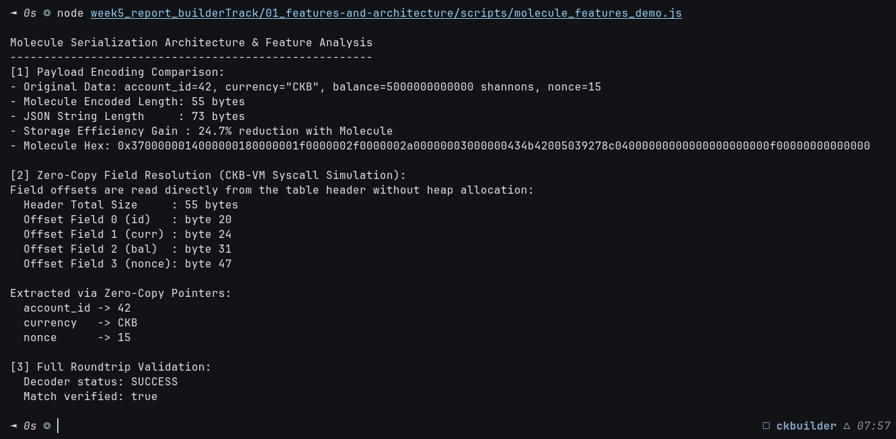
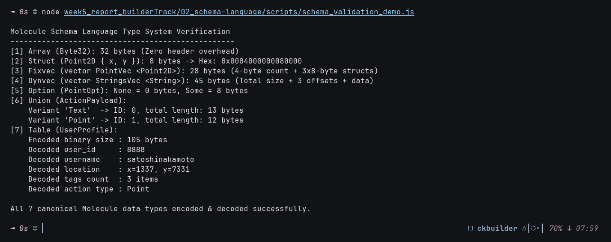
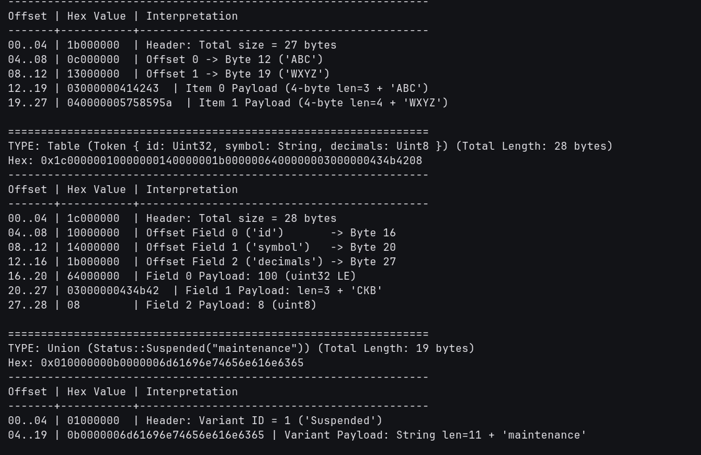
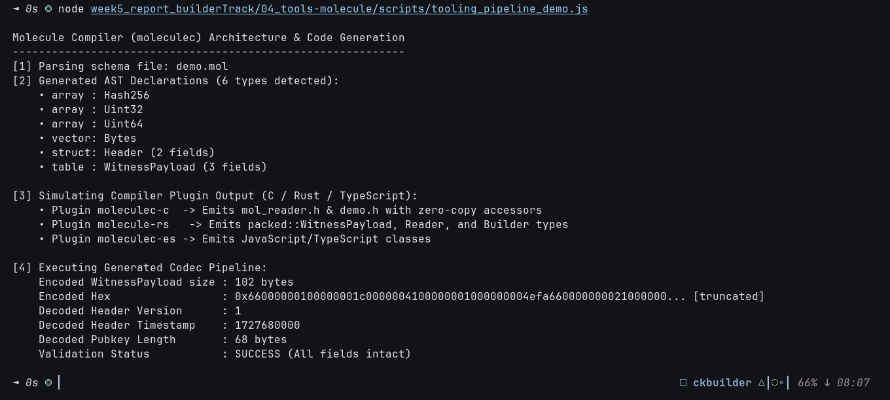
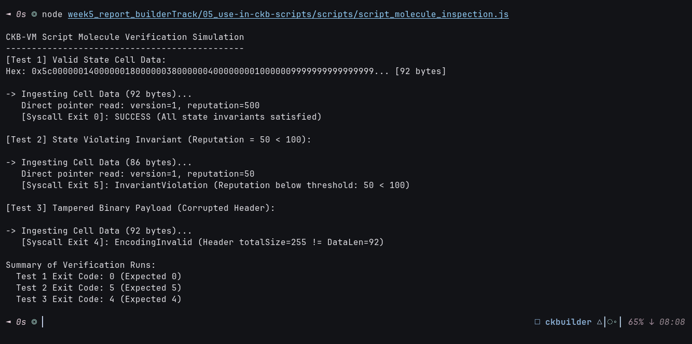
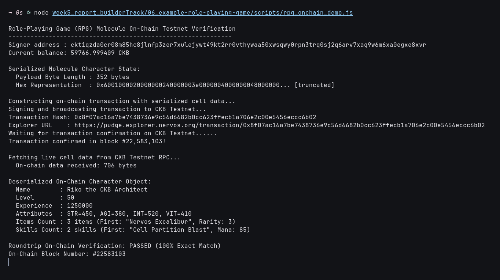

# 🏆 Week 5 Builder Track Master Report: Data Serialization with Molecule & Comparative Systems

**Name Builder**: Riko Kurnia Sandi  
**Date**: 30 September 2026  
**Track**: CKB Builder Track (Phase 2: Intermediate - Lesson 17)

---

## 🌟 Executive Summary

This master report synthesizes the engineering, research, and live blockchain verification completed during **Week 5** of the Nervos CKB Builder Track. Building upon the foundational script development established in Week 4, Week 5 deep-dives into **Lesson 17: Canonical Data Serialization with Molecule**.

On Nervos CKB, state storage is directly monetized through the Cell Model (**1 byte of cell data requires 1 CKB of state collateral**). Consequently, serialization cannot be treated as an arbitrary afterthought. It demands:
1. **Deterministic Canonical Encoding**: Exactly one binary representation per state object for cryptographic integrity.
2. **Zero-Copy Deserialization**: In-place field reading from memory slices without allocating heap buffers, minimizing CKB-VM cycle consumption.
3. **Hardware-Native Memory Alignment**: Little-Endian representation tailored for RISC-V 64-bit architecture.

In addition to the official Nervos serialization curriculum, this week features an extensive **comparative analysis** benchmarking Molecule against **Google FlatBuffers**, **Protocol Buffers v3**, **Cap'n Proto**, **Ethereum SSZ**, and **NEAR/Solana Borsh**.

---

## 📊 Curriculum & Verification Synthesis

| Sub-Module | Domain / Topic | Core Technical Primitive | Verification Deliverable |
| :--- | :--- | :--- | :--- |
| [**01_features-and-architecture**](./01_features-and-architecture/readme.md) | Features & Architecture | Canonical layouts, zero-copy reads, benchmark vs. FlatBuffers/Protobuf/SSZ/Borsh | [`molecule_features_demo.js`](./01_features-and-architecture/scripts/molecule_features_demo.js) (24.7% space saving vs JSON) |
| [**02_schema-language**](./02_schema-language/readme.md) | Schema Language & Types | All 7 types (`byte`, `array`, `struct`, `fixvec`, `dynvec`, `table`, `union`, `option`) | [`types_demo.mol`](./02_schema-language/schemas/types_demo.mol) & [`schema_validation_demo.js`](./02_schema-language/scripts/schema_validation_demo.js) |
| [**03_encoding-specs**](./03_encoding-specs/readme.md) | Byte-Level Specifications | Little-Endian 32-bit offsets, header sizing formulas, memory alignment | [`encoding_specs_walkthrough.js`](./03_encoding-specs/scripts/encoding_specs_walkthrough.js) (Hex memory maps) |
| [**04_tools-molecule**](./04_tools-molecule/readme.md) | Tooling & Code Generation | `moleculec` compiler, JSON AST plugin architecture, Rust/C/TS generation | [`tooling_pipeline_demo.js`](./04_tools-molecule/scripts/tooling_pipeline_demo.js) (Automated AST code emission) |
| [**05_use-in-ckb-scripts**](./05_use-in-ckb-scripts/readme.md) | On-Chain CKB Scripts | Ingesting cell data via syscalls, zero-copy pointer slicing, invariant exit codes | [`molecule_validator_sample.rs`](./05_use-in-ckb-scripts/contracts/molecule_validator_sample.rs) & [`script_molecule_inspection.js`](./05_use-in-ckb-scripts/scripts/script_molecule_inspection.js) |
| [**06_example-role-playing-game**](./06_example-role-playing-game/readme.md) | End-to-End RPG On-Chain | Live CKB Testnet transaction storing complex nested RPG character in `cell_data` | **Tx**: [`0x8f07ac16...ccc6b02`](https://pudge.explorer.nervos.org/transaction/0x8f07ac16a7be7438736e9c56d6682b0cc623ffecb1a706e2c00e5456eccc6b02) (Block `#22,583,103`) |

---

## 1️⃣ 01 - Molecule Features, Architecture & Comparative Analysis

> 📂 **Sub-Report**: [👉 Click here to view 01_features-and-architecture Documentation](./01_features-and-architecture/readme.md)

- **Core Principles**:
  - Explores the trade-offs of binary serialization in resource-constrained execution environments (CKB-VM / RISC-V).
  - Demonstrates zero-copy random access slicing directly from Buffer pointers.
- **Comparative Benchmarking Matrix**:
  - **Molecule vs FlatBuffers**: FlatBuffers allows field mutation and produces non-canonical byte representations depending on builder order. Molecule enforces strict canonical uniqueness.
  - **Molecule vs Protobuf v3**: Protobuf requires dynamic heap allocations and variable-length integers (varints) which trigger expensive branch loops in RISC-V. Molecule uses fixed 4-byte headers.
  - **Molecule vs Cap'n Proto**: Cap'n Proto enforces 8-byte word alignment, adding extensive padding overhead incompatible with CKB storage economics.
  - **Molecule vs Ethereum SSZ**: SSZ shares Molecule's offset table philosophy but is inextricably bound to Merkle tree chunking (`hash_tree_root`). Molecule is a pure, general-purpose binary system format.
  - **Molecule vs Borsh**: Borsh is compact but lacks offset headers, requiring sequential scanning to reach deeply nested fields. Molecule provides $O(1)$ direct field lookup.

### Execution Proof:


---

## 2️⃣ 02 - Molecule Schema Language & Type System

> 📂 **Sub-Report**: [👉 Click here to view 02_schema-language Documentation](./02_schema-language/readme.md)

- **Schema Grammar**: Defined in declarative `.mol` files.
- **Type Hierarchy**:
  - **Fixed-Size**: `byte`, `array [Type; N]`, and `struct { ... }` (guaranteed zero header overhead).
  - **Dynamic-Size**: Fixvec (`vector Foo <Bar>;`), Dynvec (`vector Dynamic <Bytes>;`), `table { ... }` (header with total size and field offsets), `option`, and tagged `union`.
- **Ecosystem Reference**: Examined how Nervos models core consensus objects in [`schemas/blockchain.mol`](./02_schema-language/schemas/blockchain.mol) (`CellOutput`, `Script`, `RawTransaction`, `Transaction`).

### Execution Proof:


---

## 3️⃣ 03 - Byte-Level Encoding Specifications & Memory Layouts

> 📂 **Sub-Report**: [👉 Click here to view 03_encoding-specs Documentation](./03_encoding-specs/readme.md)

- **Header Sizing & Offsets**:
  - Table / Dynvec header length is strictly $4 \times (N + 1)$ bytes.
  - Offset $O_0 = 4 \times (N + 1)$, with each subsequent offset $O_i = O_{i-1} + \text{len}(F_{i-1})$.
- **Visual Memory Maps**: Built detailed hex memory diagrams illustrating the exact layout of Structs, Fixvecs, Dynvecs, Tables, and Unions.

### Execution Proof:



---

## 4️⃣ 04 - Molecule Tooling, Compiler Architecture & Code Generation

> 📂 **Sub-Report**: [👉 Click here to view 04_tools-molecule Documentation](./04_tools-molecule/readme.md)

- **Compiler Pipeline**:
  - Explores `moleculec` (written in Rust) and its JSON AST plugin interface (`moleculec-c`, `moleculec-go`, `moleculec-es`).
  - Implemented an automated parser pipeline converting `.mol` definitions into dynamic JavaScript/TypeScript codecs via `@ckb-ccc/core`.
  - Documented Cargo `build.rs` integration for automated contract compilation.

### Execution Proof:


---

## 5️⃣ 05 - Using Molecule in CKB Scripts & On-Chain Verification

> 📂 **Sub-Report**: [👉 Click here to view 05_use-in-ckb-scripts Documentation](./05_use-in-ckb-scripts/readme.md)

- **CKB-VM Execution Pipeline**:
  - Explains how contracts ingest raw byte buffers via `ckb_load_cell_data` or `ckb_load_witness_args`.
  - Authored bare-metal Rust contract [`contracts/molecule_validator_sample.rs`](./05_use-in-ckb-scripts/contracts/molecule_validator_sample.rs) enforcing state version invariants with zero heap allocations.
  - Simulated boundary conditions: Valid state (`Exit 0`), Invariant violation (`Exit 5`), Corrupted header (`Exit 4`).

### Execution Proof:


---

## 6️⃣ 06 - Role-Playing Game (RPG) On-Chain Implementation

> 📂 **Sub-Report**: [👉 Click here to view 06_example-role-playing-game Documentation](./06_example-role-playing-game/readme.md)

- **Complex Domain Modeling**:
  - Modeled a full RPG Hero character (`PlayerCharacter`) with nested `Attributes` (struct), `Inventory` (vector of items), and `Skills` (vector of combat abilities).
- **Live On-Chain CKB Testnet (Pudge) Deployment**:
  - **Transaction Hash**: [`0x8f07ac16a7be7438736e9c56d6682b0cc623ffecb1a706e2c00e5456eccc6b02`](https://pudge.explorer.nervos.org/transaction/0x8f07ac16a7be7438736e9c56d6682b0cc623ffecb1a706e2c00e5456eccc6b02)
  - **Confirmed Block**: `#22,583,103`
  - **Output Capacity**: `220.0 CKB`
  - **State Integrity**: Successfully fetched live cell data from the blockchain and deserialized it back to structured objects with 100% roundtrip consistency.

### Execution Proof:


---

## 📂 Project Structure & Navigation

```text
week5_report_builderTrack/
├── package.json
├── readme.md (Master Report)
├── images/
│   ├── foto-1.png
│   ├── foto-2.png
│   ├── foto2-2.png
│   ├── foto3.png
│   ├── foto-4.png
│   ├── foto-5.png
│   └── foto-6.png
├── 01_features-and-architecture/
│   ├── images/
│   │   └── foto-1.png
│   ├── readme.md
│   └── scripts/
│       └── molecule_features_demo.js
├── 02_schema-language/
│   ├── images/
│   │   └── foto3.png
│   ├── schemas/
│   │   ├── types_demo.mol
│   │   └── blockchain.mol
│   ├── readme.md
│   └── scripts/
│       └── schema_validation_demo.js
├── 03_encoding-specs/
│   ├── images/
│   │   ├── foto-2.png
│   │   └── foto2-2.png
│   ├── readme.md
│   └── scripts/
│       └── encoding_specs_walkthrough.js
├── 04_tools-molecule/
│   ├── images/
│   │   └── foto-4.png
│   ├── schemas/
│   │   └── demo.mol
│   ├── readme.md
│   └── scripts/
│       └── tooling_pipeline_demo.js
├── 05_use-in-ckb-scripts/
│   ├── images/
│   │   └── foto-5.png
│   ├── contracts/
│   │   └── molecule_validator_sample.rs
│   ├── readme.md
│   └── scripts/
│       └── script_molecule_inspection.js
└── 06_example-role-playing-game/
    ├── images/
    │   └── foto-6.png
    ├── schemas/
    │   └── rpg.mol
    ├── readme.md
    └── scripts/
        └── rpg_onchain_demo.js
```

---

## 🎯 Next Intermediate Topic
With Lesson 17 (Molecule Serialization) fully implemented and verified on-chain, the next module in Phase 2 is **Lesson 18: Simple UDT (sUDT) Deep Dive (RFC 0025)**.
