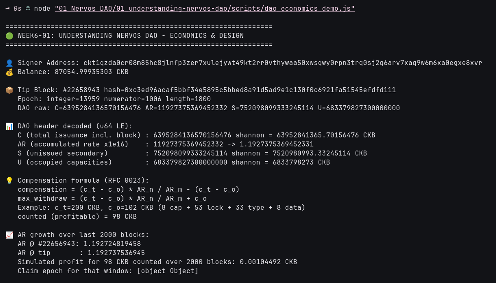

# 🧬 01 - Understanding Nervos DAO: Economics & Inflation Shelter

**Module**: Week 6 - Nervos DAO Track (Part 1/4)  
**Author**: Riko Kurnia Sandi  
**Official Reference**: [Blockworks AI: Understanding Nervos DAO](https://app.blockworks.com/ai/share/understanding-nervos-dao-830c1d00-0afc-47aa-a65c-465701adc67f?from=messari) | [RFC 0015 Cryptoeconomics](https://github.com/nervosnetwork/rfcs/blob/master/rfcs/0015-ckb-cryptoeconomics/0015-ckb-cryptoeconomics.md) | [Nervos DAO + Cell Model (Medium)](https://medium.com/nervosnetwork/understanding-the-nervos-dao-and-cell-model-d68f38272c24)

---

## 1. Overview & Core Philosophy

**Nervos DAO** is a native genesis system contract that gives long-term CKByte holders a **dilution counter-measure** against CKB secondary issuance. Unlike staking, it does not secure the chain — it shelters value:

1. **Primary issuance**: hard-capped, Bitcoin-like halving every 4 years (pays miners).
2. **Secondary issuance**: constant per epoch (pays miners + DAO depositors + treasury). Rate decays toward zero as supply grows.
3. **DAO compensation**: locked cells earn proportional secondary (`AR_n / AR_m`), auto-compounding on withdraw. Non-depositors are diluted; depositors keep Bitcoin-like max-supply effect.
4. **Scale**: >9.2B CKB deposited mid-2024 (~20-21% supply), min 102 CKB, min 1 cycle (~30 days / 180 epochs).

---

## 2. DAO Header Economics (`dao` field, 32 bytes)

Each block header carries `C_i | AR_i | S_i | U_i` as 4x u64 LE (`AR` x1e16). Verified live on Pudge testnet:

| Field | Meaning | Tip value (block #22,658,348) |
| :--- | :--- | :--- |
| `C` | total issuance incl. block | `63952321533.12926446 CKB` |
| `AR` | accumulated rate x1e16 | `11927337535149834 (1.192733753515)` |
| `S` | unissued secondary (DAO comp + treasury) | `7520799809.00844481 CKB` |
| `U` | occupied capacities (state storage) | `6833761934 CKB` |

`AR_j / AR_i` = amount 1 CKB deposited at `i` becomes at `j`. Formula (RFC 0023):

```text
compensation   = (c_t - c_o) * AR_n / AR_m - (c_t - c_o)
max_withdraw   = (c_t - c_o) * AR_n / AR_m + c_o
c_o = 102 CKB (8 cap + 53 lock + 33 type + 8 data)
```

Measured: AR grew `1.192721035965 -> 1.192733753515` over 2000 blocks (~0.00104493 CKB profit per 98 CKB counted).

---

## 3. Practical Demonstration

Executable: [`scripts/dao_economics_demo.js`](./scripts/dao_economics_demo.js)

```text
=================================================================
🟢 WEEK6-01: UNDERSTANDING NERVOS DAO - ECONOMICS & DESIGN
=================================================================
👤 Signer Address: ckt1qzda0cr08m85hc8jlnfp3zer7xulejywt49kt2rr0vthywaa50xwsqwy0rpn3trq0sj2q6arv7xaq9w6m6xa0egxe8xvr
📦 Tip Block: #22658348 hash=0x60962c4197757434afd779801cea8848d111e21eddfaaa55d2bc95f35b6fbb22
   DAO raw: C=6395232153312926446 AR=11927337535149834 S=752079980900844481 U=683376193400000000
📈 AR growth over last 2000 blocks:
   AR @ #22656348: 1.192721035965
   AR @ tip       : 1.192733753515
   Simulated profit for 98 CKB counted over 2000 blocks: 0.00104493 CKB
🏁 Week6-01 Economics Check Complete!
```

> 📸 **Execution Proof**: terminal run of `dao_economics_demo.js` (tip #22,658,943, AR 1.192737536945):
>
> 

---

## 4. Summary Findings

- DAO is inflation shelter, not staking: yield is variable, annual, auto-compounding, decreasing with supply.
- Deposit cycle = 180 epochs; withdraw only at cycle end; early request stops accrual (maps to `since` + `dao.c` lock check).
- Next: formal deposit/withdraw wire format in [02_rfc0023-deposit-withdraw](../02_rfc0023-deposit-withdraw/readme.md).

## 🚀 Reproduction Guide

```bash
cd week6_report_builderTrack
npm install
node "01_Nervos DAO/01_understanding-nervos-dao/scripts/dao_economics_demo.js"
```
