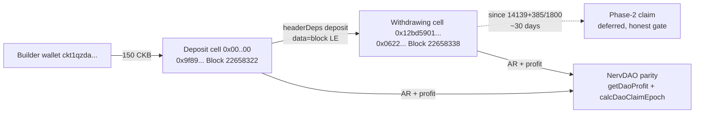

# 🏛️ 01 - Nervos DAO: Deposit, Withdraw Phases, dao.c & NervDAO Portal

**Module**: Week 6 - Nervos DAO (Handbook Intermediate: Nervos DAO)  
**Author**: Riko Kurnia Sandi  
**Sources**: [Blockworks Understanding DAO](https://app.blockworks.com/ai/share/understanding-nervos-dao-830c1d00-0afc-47aa-a65c-465701adc67f?from=messari) | [RFC 0023](https://github.com/nervosnetwork/rfcs/blob/master/rfcs/0023-dao-deposit-withdraw/0023-dao-deposit-withdraw.md) | [dao.c](https://github.com/nervosnetwork/ckb-system-scripts/blob/master/c/dao.c) | [nervdao](https://github.com/ckb-devrel/nervdao)

---

## 🌟 Module Summary

This module completes the Handbook **Nervos DAO** block end-to-end: economics intuition, RFC 0023 wire format, `dao.c` enforcement, and browser-portal reproduction. Two live Pudge transactions prove the full deposit -> withdrawing transition; phase-2 claim is honestly deferred to its 180-epoch lock.

## 📊 Verification Matrix

| Sub-module | Topic | Deliverable | Status |
| :--- | :--- | :--- | :--- |
| [01_understanding-nervos-dao](./01_understanding-nervos-dao/readme.md) | Economics & AR model | [`dao_economics_demo.js`](./01_understanding-nervos-dao/scripts/dao_economics_demo.js) (AR 1.19273, +0.00104/2000 blocks) | 🟢 Off-chain verified |
| [02_rfc0023-deposit-withdraw](./02_rfc0023-deposit-withdraw/readme.md) | RFC 0023 deposit | Tx [`0x9f8978a2...fe7ae4`](https://pudge.explorer.nervos.org/transaction/0x9f8978a24370f30254ad1c64ffcd86c9265e9994976430ef43fa7e7cf2fe7ae4) Block `#22,658,322` | 🟢 Committed |
| [03_dao-c-system-script](./03_dao-c-system-script/readme.md) | dao.c + phase-1 | Tx [`0x0622873c...43eaf4d`](https://pudge.explorer.nervos.org/transaction/0x0622873cab21248e9e70bda8cca39b09f09b493277136dcef407ed22343eaf4d) Block `#22,658,338` | 🟢 Committed |
| [04_nervdao-portal](./04_nervdao-portal/readme.md) | NervDAO portal parity | [`nervdao_portal_demo.js`](./04_nervdao-portal/scripts/nervdao_portal_demo.js) (profit 0.00000409, claim 14139) | 🟢 Verified, phase-2 gated |

## 🏗️ DAO Lifecycle (this module)



## 🚀 Run All

```bash
cd week6_report_builderTrack
npm install
node "01_Nervos DAO/01_understanding-nervos-dao/scripts/dao_economics_demo.js"
DEPOSIT_CKB=150 node "01_Nervos DAO/02_rfc0023-deposit-withdraw/scripts/dao_deposit_demo.js"
DEPOSIT_TX_HASH=0x9f8978a24370f30254ad1c64ffcd86c9265e9994976430ef43fa7e7cf2fe7ae4 node "01_Nervos DAO/03_dao-c-system-script/scripts/dao_phase1_demo.js"
node "01_Nervos DAO/04_nervdao-portal/scripts/nervdao_portal_demo.js"
```
