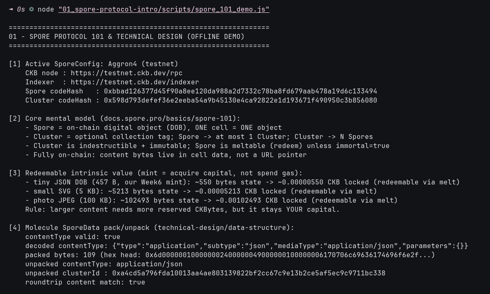

# 🧬 01 - Spore Protocol 101 & Technical Design

> **Fully on-chain Digital Objects (DOBs) with redeemable CKB value — Spore Cell vs Cluster Cell, Molecule serialization, zero-fee transfers**
> Handbook Intermediate (Spore): `docs.spore.pro` intro + Spore 101 + Technical Design. Offline concept + codec proof; live mint lands in `06_onchain-practice`.

**Module**: Week 6 - Spore DOBs (02_Spore)  
**Author**: Riko Kurnia Sandi  
**Official References**: [Spore Docs](https://docs.spore.pro/) | [Spore 101](https://docs.spore.pro/basics/spore-101) | [Technical Design](https://docs.spore.pro/basics/technical-design/) | [spore-sdk](https://github.com/sporeprotocol/spore-sdk) | [spore-contract](https://github.com/sporeprotocol/spore-contract)

---

## 🌟 Executive Summary

Spore turns a CKB cell into a first-class digital object: **one cell = one Spore**, with content bytes stored directly in cell data (not a URL). Minting locks CKBytes as **redeemable capital** (melt anytime to reclaim), not gas. An optional **Cluster** cell tags many Spores into a collection; Clusters are immutable and indestructible, Spores are meltable unless `immortal=true`.

This module proves the data model offline with `@spore-sdk/core` Molecule codecs (`packRawSporeData` / `unpackToRawSporeData`), capacity economics, and zero-fee margin mechanics — the exact primitives later broadcast live in module 06.

---

## 📸 Screenshots & Proof of Work



> Save terminal capture as `01_spore-protocol-intro/images/foto-1.png` (run script below, screenshot).

---

## ⚙️ Step-by-Step Practical Execution

1. **Config load**: `predefinedSporeConfigs.Aggron4` (testnet) — Spore `codeHash 0xbbad...3494`, Cluster `codeHash 0x598d...6080`, RPC `https://testnet.ckb.dev/rpc`.
2. **Mental model**: Spore (meltable DOB) vs Cluster (1 Spore → max 1 Cluster; 1 Cluster → N Spores).
3. **Intrinsic value math**: `state bytes ≈ cell overhead + content`; 457 B JSON ≈ 550 B state; larger art needs proportionally more locked CKB, all reclaimable.
4. **Molecule roundtrip**: pack `{contentType, content, clusterId}` → 109 bytes → unpack → `contentType application/json`, `clusterId 0xa4cd...` preserved, content hex match `true`.
5. **Zero-fee margin**: default `capacityMargin = 1 CKB` pre-funds receiver's next ~100k ops; override to 2 CKB via `BI.from(2_0000_0000)`.
6. **Privacy boundary**: owner lock + content are public; never embed secrets.

---

## 💻 Terminal Execution Output

```text
===============================================================
01 - SPORE PROTOCOL 101 & TECHNICAL DESIGN (OFFLINE DEMO)
===============================================================

[1] Active SporeConfig: Aggron4 (testnet)
    CKB node : https://testnet.ckb.dev/rpc
    Indexer  : https://testnet.ckb.dev/indexer
    Spore codeHash   : 0xbbad126377d45f90a8ee120da988a2d7332c78ba8fd679aab478a19d6c133494
    Cluster codeHash : 0x598d793defef36e2eeba54a9b45130e4ca92822e1d193671f490950c3b856080

[2] Core mental model (docs.spore.pro/basics/spore-101):
    - Spore = on-chain digital object (DOB), ONE cell = ONE object
    - Cluster = optional collection tag; Spore -> at most 1 Cluster; Cluster -> N Spores
    - Cluster is indestructible + immutable; Spore is meltable (redeem) unless immortal=true
    - Fully on-chain: content bytes live in cell data, not a URL pointer

[3] Redeemable intrinsic value (mint = acquire capital, not spend gas):
    - tiny JSON DOB (457 B, our Week6 mint): ~550 bytes state -> ~0.00000550 CKB locked (redeemable via melt)
    - small SVG (5 KB): ~5213 bytes state -> ~0.00005213 CKB locked (redeemable via melt)
    - photo JPEG (100 KB): ~102493 bytes state -> ~0.00102493 CKB locked (redeemable via melt)

[4] Molecule SporeData pack/unpack (technical-design/data-structure):
    contentType valid: true
    decoded contentType: {"type":"application","subtype":"json","mediaType":"application/json","parameters":{}}
    packed bytes: 109 (hex head: 0x6d000000100000002400000049000000100000006170706c69636174696f6e2f...)
    unpacked contentType: application/json
    unpacked clusterId : 0xa4cd5a796fda10013aa4ae803139822bf2cc67c9e13b2ce5af5ec9c9711bc338
    roundtrip content match: true

[5] Zero-fee transfer margin (technical-design/fee-transfer):
    - createSpore defaults capacityMargin = 1 CKB (100,000,000 shannons)
    - margin pre-funds ~100k future txs so receivers need NO gas to transfer/melt

[6] On-chain privacy note (technical-design/on-chain-privacy):
    - Spore content + owner lock are public; privacy comes from pseudonymous locks,
      not encryption. Do NOT put secrets in Spore content.

01 Practical Execution Complete!
```

---

## 🚀 Reproduction Guide

```bash
cd "week6_report_builderTrack/02_Spore (DOBs)"
npm install
node "01_spore-protocol-intro/scripts/spore_101_demo.js"
```

## 🔗 Next

Continue to [02_dob-cookbook](../02_dob-cookbook/readme.md) for DOB/0 vs DOB/1 rendering patterns.
