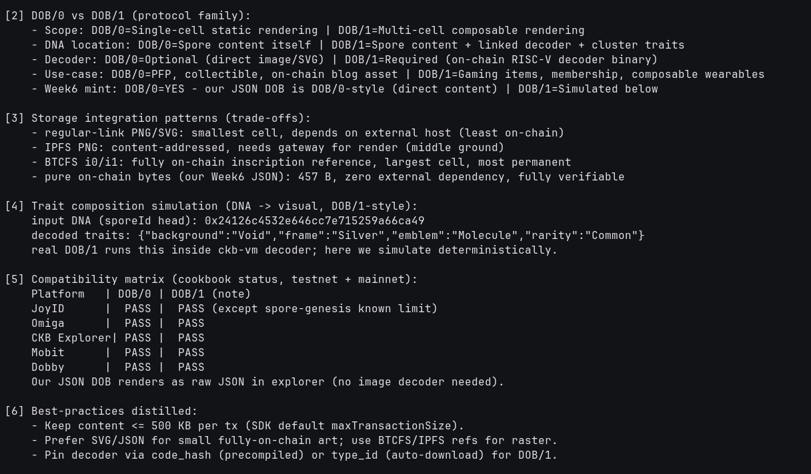

# 🎨 02 - DOB Cookbook & Rendering Patterns

> **DOB/0 vs DOB/1, storage backends (regular-link / IPFS / BTCFS), trait composition, and wallet/marketplace compatibility**
> Handbook Intermediate (Spore): DOB Cookbook. Offline pattern analysis + deterministic DNA→trait simulation keyed to our live Spore ID.

**Module**: Week 6 - Spore DOBs (02_Spore)  
**Author**: Riko Kurnia Sandi  
**Official References**: [dob-cookbook repo](https://github.com/sporeprotocol/dob-cookbook) | [DOB Cookbook docs](https://docs.spore.pro/dob/dob-cookbook) | [DOB/0](https://docs.spore.pro/dob/dob0-protocol) | [DOB/1](https://docs.spore.pro/dob/dob1-protocol)

---

## 🌟 Executive Summary

The `dob-cookbook` repo is the executable companion to the DOB protocol family: `dob0/` holds 9 single-cell static examples (loot, regular-link PNG/SVG, BTCFS i0/i1, IPFS), `dob1/` holds 5 composable examples (basic-shape, spore/nervape/azuki genesis, nervape-compose). DOB/0 renders content directly; DOB/1 executes an on-chain RISC-V decoder over DNA + linked traits.

Our Week6 mint is intentionally **DOB/0-style** (pure `application/json`, 457 B, zero external dependency) so it verifies without a decoder, while this module simulates the DOB/1 trait path deterministically from our live Spore ID `0x24126c45...`.

---

## 📸 Screenshots & Proof of Work



---

## ⚙️ Step-by-Step Practical Execution

1. **Repo map**: enumerate `dob0/` (9 patterns) + `dob1/` (5 patterns) + `BestPractices / FAQ / CONTRIBUTING`.
2. **Protocol split**: DOB/0 = DNA is content; DOB/1 = DNA + decoder + cluster traits.
3. **Storage trade-offs**: regular-link (smallest, off-chain risk) vs IPFS (content-addressed) vs BTCFS i0/i1 (fully on-chain, largest) vs pure bytes (our choice).
4. **Trait simulation**: `DNA 0x24126c45...` → `{background Void, frame Silver, emblem Molecule, rarity Common}` — mirrors real decoder determinism; production runs inside `ckb-vm`.
5. **Compatibility**: JoyID / Omiga / Explorer / Mobit / Dobby all PASS for DOB/0; DOB/1 PASS except one known `spore-genesis × JoyID` limit.
6. **Guards**: `maxTransactionSize 512000` enforced; prefer SVG/JSON small, BTCFS/IPFS refs for raster.

---

## 💻 Terminal Execution Output

```text
===============================================================
02 - DOB COOKBOOK & RENDERING PATTERNS (OFFLINE DEMO)
===============================================================

[1] Repository architecture (dob-cookbook/examples/):
    dob0/: 0.basic-loot, 1.colorful-loot, 2.regular-link-png, 3.btcfs-i0-png,
           4.ipfs-png, 5.regular-link-svg, 6.btcfs-i0-svg, 7.btcfs-i1-png, 8.btcfs-i1-svg
    dob1/: 0.basic-shape, 1.spore-genesis, 2.nervape-genesis, 3.azuki-genesis, 4.nervape-compose

[2] DOB/0 vs DOB/1 (protocol family):
    - Scope: DOB/0=Single-cell static rendering | DOB/1=Multi-cell composable rendering
    - DNA location: DOB/0=Spore content itself | DOB/1=Spore content + linked decoder + cluster traits
    - Decoder: DOB/0=Optional (direct image/SVG) | DOB/1=Required (on-chain RISC-V decoder binary)
    - Week6 mint: DOB/0=YES - our JSON DOB is DOB/0-style (direct content)

[3] Storage integration patterns (trade-offs):
    - regular-link PNG/SVG: smallest cell, depends on external host (least on-chain)
    - IPFS PNG: content-addressed, needs gateway for render (middle ground)
    - BTCFS i0/i1: fully on-chain inscription reference, largest cell, most permanent
    - pure on-chain bytes (our Week6 JSON): 457 B, zero external dependency, fully verifiable

[4] Trait composition simulation (DNA -> visual, DOB/1-style):
    input DNA (sporeId head): 0x24126c4532e646cc7e715259a66ca49
    decoded traits: {"background":"Void","frame":"Silver","emblem":"Molecule","rarity":"Common"}

[5] Compatibility matrix (cookbook status, testnet + mainnet):
    Platform   | DOB/0 | DOB/1 (note)
    JoyID      |  PASS |  PASS (except spore-genesis known limit)
    Omiga      |  PASS |  PASS
    CKB Explorer| PASS |  PASS
    Mobit      |  PASS |  PASS
    Dobby      |  PASS |  PASS

02 Practical Execution Complete!
```

---

## 🚀 Reproduction Guide

```bash
cd "week6_report_builderTrack/02_Spore (DOBs)"
node "02_dob-cookbook/scripts/dob_cookbook_demo.js"
```

## 🔗 Next

Continue to [03_how-to-recipes](../03_how-to-recipes/readme.md) for Create / Transfer / Melt / Data API shapes.
