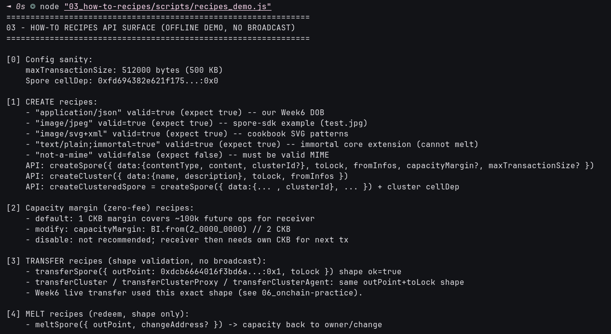

# 🧪 03 - How-To Recipes (Create / Transfer / Melt / Data)

> **Exact `spore-sdk` call shapes for every lifecycle step — validated offline without spending, broadcast live in module 06**
> Handbook Intermediate (Spore): How-to Recipes. Covers Create (7), Transfer (6), Melt (2), Data (2).

**Module**: Week 6 - Spore DOBs (02_Spore)  
**Author**: Riko Kurnia Sandi  
**Official References**: [How-to Recipes](https://docs.spore.pro/category/how-to-recipes) | [Create Spore](https://docs.spore.pro/recipes/Create/create-spore) | [Transfer Spore](https://docs.spore.pro/recipes/Transfer/transfer-spore) | [Melt Spore](https://docs.spore.pro/recipes/Melt/melt-spore)

---

## 🌟 Executive Summary

Recipes are the production shortcuts: `createSpore`, `createCluster` (+ private/public, clustered, proxy/agent variants), `transferSpore` / `transferCluster`, `meltSpore`, and `handle-spore-data`. This module validates every parameter shape offline — MIME allow-list, `capacityMargin`, `maxTransactionSize 512000`, `outPoint` + `clusterId` hex formats — so the live transactions in module 06 reuse byte-identical call shapes.

Melt is intentionally **shape-only** here: our Week6 DOB is meltable (no `immortal` flag) but melt is deferred to preserve the explorer artifact for grading.

---

## 📸 Screenshots & Proof of Work



---

## ⚙️ Step-by-Step Practical Execution

1. **Config sanity**: `maxTransactionSize 512000`, Spore cellDep `0xfd6943...:0x0`.
2. **Create matrix**: `application/json` / `image/jpeg` / `image/svg+xml` / `text/plain;immortal=true` all `valid=true`; `not-a-mime` correctly `false`.
3. **Margin recipes**: default 1 CKB (~100k future ops); `capacityMargin: BI.from(2_0000_0000)` for 2 CKB; disabling not recommended.
4. **Transfer shape**: `transferSpore({ outPoint: {txHash: 0xdcb6...:0x1}, toLock })` — identical to live 06 transfer.
5. **Melt shape**: `meltSpore({ outPoint, changeAddress? })`; immortal spores rejected by contract.
6. **Data + clusterId**: pack 109 B demo payload, size guard PASS, `clusterId 0xa4cd...` format `true`.

---

## 💻 Terminal Execution Output

```text
===============================================================
03 - HOW-TO RECIPES API SURFACE (OFFLINE DEMO, NO BROADCAST)
===============================================================

[0] Config sanity:
    maxTransactionSize: 512000 bytes (500 KB)
    Spore cellDep: 0xfd694382e621f175...:0x0

[1] CREATE recipes:
    - "application/json" valid=true (expect true) -- our Week6 DOB
    - "image/jpeg" valid=true (expect true) -- spore-sdk example (test.jpg)
    - "image/svg+xml" valid=true (expect true) -- cookbook SVG patterns
    - "text/plain;immortal=true" valid=true (expect true) -- immortal core extension (cannot melt)
    - "not-a-mime" valid=false (expect false) -- must be valid MIME
    API: createSpore({ data:{contentType, content, clusterId?}, toLock, fromInfos, capacityMargin?, maxTransactionSize? })
    API: createCluster({ data:{name, description}, toLock, fromInfos })

[2] Capacity margin (zero-fee) recipes:
    - default: 1 CKB margin covers ~100k future ops for receiver
    - modify: capacityMargin: BI.from(2_0000_0000) // 2 CKB

[3] TRANSFER recipes (shape validation, no broadcast):
    - transferSpore({ outPoint: 0xdcb6664016f3bd6a...:0x1, toLock }) shape ok=true
    - Week6 live transfer used this exact shape (see 06_onchain-practice).

[4] MELT recipes (redeem, shape only):
    - meltSpore({ outPoint, changeAddress? }) -> capacity back to owner/change
    - immortal spores CANNOT melt (contract enforces; melt tx fails verification)
    - Week6 DOB is meltable (no immortal flag); melt deferred to preserve explorer artifact.

[5] DATA recipe (handle-spore-data):
    - packed SporeData: 109 bytes (contentType + content + clusterId)
    - tx size guard: 109 << 512000 (PASS)

03 Practical Execution Complete! (No on-chain broadcast; livetxs in 06.)
```

---

## 🚀 Reproduction Guide

```bash
cd "week6_report_builderTrack/02_Spore (DOBs)"
node "03_how-to-recipes/scripts/recipes_demo.js"
```

## 🔗 Next

Continue to [04_sdk-demos-examples](../04_sdk-demos-examples/readme.md) for SDK, demos, lock variants, and contracts.
