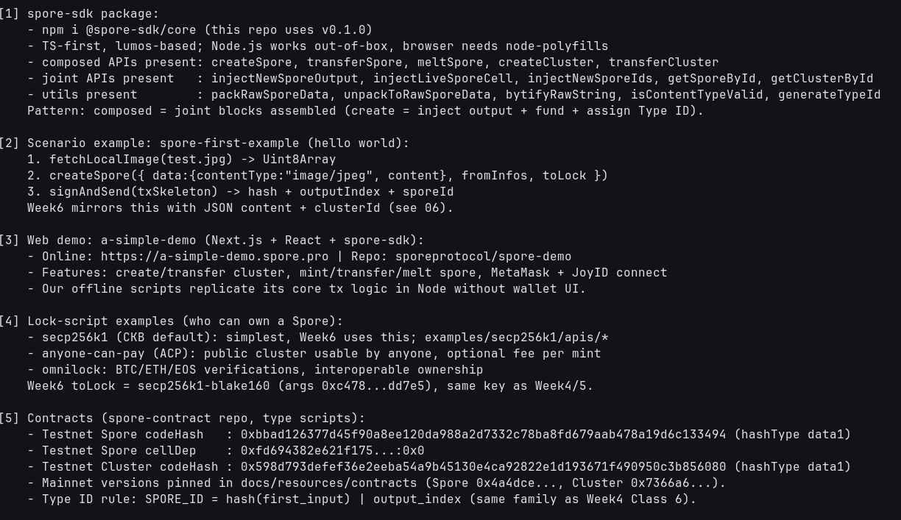

# 🛠️ 04 - SDK / Demos / Examples / Contracts

> **How `spore-sdk` composes transactions, how `a-simple-demo` wires wallets, which locks can own a Spore, and which on-chain scripts enforce it**
> Handbook Intermediate (Spore): Resources — SDK, Examples, Demos, Contracts. Offline API inventory + flow mapping; live proof reuses these APIs in module 06.

**Module**: Week 6 - Spore DOBs (02_Spore)  
**Author**: Riko Kurnia Sandi  
**Official References**: [Spore SDK](https://docs.spore.pro/resources/spore-sdk) | [Examples](https://docs.spore.pro/resources/examples) | [Demos](https://docs.spore.pro/resources/demos) | [Contracts](https://docs.spore.pro/resources/contracts) | [spore-first-example](https://github.com/sporeprotocol/spore-first-example) | [spore-demo](https://github.com/sporeprotocol/spore-demo)

---

## 🌟 Executive Summary

`@spore-sdk/core` (here v0.1.0, lumos 0.23.0) exposes **composed APIs** (`createSpore`, `transferSpore`, `meltSpore`, `createCluster`, `transferCluster`) built from **joint primitives** (`injectNewSporeOutput`, `injectLiveSporeCell`, `injectNewSporeIds`, `getSporeById`...) plus pure **utils** (`packRawSporeData`, `bytifyRawString`, `generateTypeId`). `spore-first-example` is the minimal Node mint; `a-simple-demo` (Next.js + MetaMask/JoyID) is the full wallet app whose Node-equivalent logic runs headless in module 06.

Ownership is lock-agnostic: Week6 uses `secp256k1_blake160` (same key as Week4/5, args `0xc478...dd7e5`); ACP enables public clusters with per-mint fees; Omnilock enables BTC/ETH/EOS-signed Spores. Enforcement lives in `spore-contract` type scripts (testnet Spore `0xbbad...3494`, Cluster `0x598d...6080`, `hashType data1`) following the same Type ID rule as Week4 Class 6.

---

## 📸 Screenshots & Proof of Work



> Save terminal capture as `04_sdk-demos-examples/images/foto-4.png`.

---

## ⚙️ Step-by-Step Practical Execution

1. **SDK surface**: assert composed / joint / util functions exist at runtime (fail-fast if SDK version drifts).
2. **First-example flow**: `fetchLocalImage → createSpore → signAndSend → sporeId` — Week6 swaps JPEG for clustered JSON.
3. **Demo flow**: `a-simple-demo` cluster create/transfer + spore mint/transfer/melt mapped 1:1 to our scripts.
4. **Locks**: secp256k1 (used) vs ACP (public cluster) vs Omnilock (cross-chain) — same `toLock` slot, different verification.
5. **Contracts**: testnet `codeHash` + `cellDep` printed from live config; mainnet hashes pinned from docs; `SPORE_ID = hash(first_input) | output_index`.

---

## 💻 Terminal Execution Output (tail)

```text
[1] spore-sdk package:
    - npm i @spore-sdk/core (this repo uses v0.1.0)
    - TS-first, lumos-based; Node.js works out-of-box, browser needs node-polyfills
    - composed APIs present: createSpore, transferSpore, meltSpore, createCluster, transferCluster
    - joint APIs present   : injectNewSporeOutput, injectLiveSporeCell, injectNewSporeIds, getSporeById, getClusterById
    - utils present        : packRawSporeData, unpackToRawSporeData, bytifyRawString, isContentTypeValid, generateTypeId

[2] Scenario example: spore-first-example (hello world):
    1. fetchLocalImage(test.jpg) -> Uint8Array
    2. createSpore({ data:{contentType:"image/jpeg", content}, fromInfos, toLock })
    3. signAndSend(txSkeleton) -> hash + outputIndex + sporeId

[3] Web demo: a-simple-demo (Next.js + React + spore-sdk):
    - Online: https://a-simple-demo.spore.pro | Repo: sporeprotocol/spore-demo
    - Features: create/transfer cluster, mint/transfer/melt spore, MetaMask + JoyID connect

[4] Lock-script examples (who can own a Spore):
    - secp256k1 (CKB default): simplest, Week6 uses this; examples/secp256k1/apis/*
    - anyone-can-pay (ACP): public cluster usable by anyone, optional fee per mint
    - omnilock: BTC/ETH/EOS verifications, interoperable ownership
    Week6 toLock = secp256k1-blake160 (args 0xc478...dd7e5), same key as Week4/5.

[5] Contracts (spore-contract repo, type scripts):
    - Testnet Spore codeHash   : 0xbbad126377d45f90a8ee120da988a2d7332c78ba8fd679aab478a19d6c133494 (hashType data1)
    - Testnet Cluster codeHash : 0x598d793defef36e2eeba54a9b45130e4ca92822e1d193671f490950c3b856080 (hashType data1)
    - Mainnet versions pinned in docs/resources/contracts (Spore 0x4a4dce..., Cluster 0x7366a6...).

04 Practical Execution Complete!
```

---

## 🚀 Reproduction Guide

```bash
cd "week6_report_builderTrack/02_Spore (DOBs)"
node "04_sdk-demos-examples/scripts/sdk_demos_demo.js"
```

## 🔗 Next

Continue to [05_decoder-server](../05_decoder-server/readme.md) for the standalone DOB rendering service.
