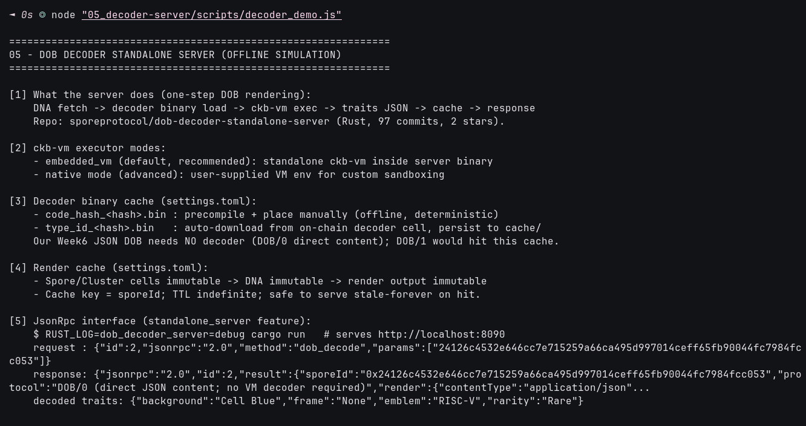

# 🖥️ 05 - DOB Decoder Standalone Server

> **One-step `dob_decode` rendering: embedded `ckb-vm` + decoder cache + render cache + protocol-version pinning — simulated offline, verifiable on-chain in module 06**
> Handbook Intermediate (Spore): DOB Decoder Standalone Server. No `cargo run` needed here; behavior simulated deterministically for our live Spore ID.

**Module**: Week 6 - Spore DOBs (02_Spore)  
**Author**: Riko Kurnia Sandi  
**Official References**: [dob-decoder-standalone-server](https://github.com/sporeprotocol/dob-decoder-standalone-server) | [DOB/0](https://docs.spore.pro/dob/dob0-protocol) | [DOB/1](https://docs.spore.pro/dob/dob1-protocol)

---

## 🌟 Executive Summary

The Rust server squashes `DNA fetch → decoder load → ckb-vm exec → traits → cache` into a single `dob_decode(sporeId)` JSON-RPC call on `:8090`. `embedded_vm` (default) bundles `ckb-vm`; native mode accepts a custom VM. Decoder binaries cache as `code_hash_<hash>.bin` (manual precompile) or `type_id_<hash>.bin` (auto-download from on-chain decoder cell); renders cache forever by `sporeId` because Spore/Cluster cells are immutable. One instance serves one DOB protocol version.

Our Week6 DOB is DOB/0 direct-JSON so it needs **no VM decoder** — this module simulates the server's request/response for our live Spore `0x24126c45...` and states the honest boundary (no port 8090 was opened here).

---

## 📸 Screenshots & Proof of Work



---

## ⚙️ Step-by-Step Practical Execution

1. **Pipeline**: DNA fetch → decoder binary load → `ckb-vm` exec → traits JSON → cache → response.
2. **Executor**: `embedded_vm` recommended; native = advanced custom sandbox.
3. **Decoder cache**: `code_hash_*` manual vs `type_id_*` auto-download; our DOB/0 bypasses both.
4. **Render cache**: key = `sporeId`, indefinite TTL (immutability makes stale-forever safe).
5. **RPC shape**: `{id:2, jsonrpc:"2.0", method:"dob_decode", params:[sporeIdNo0x]}` → `{traits:{background, frame, emblem, rarity}}`.
6. **Version pin**: one version per instance; run parallel instances for DOB/0 + DOB/1; errors in `src/types.rs`.

---

## 💻 Terminal Execution Output (tail)

```text
[1] What the server does (one-step DOB rendering):
    DNA fetch -> decoder binary load -> ckb-vm exec -> traits JSON -> cache -> response

[2] ckb-vm executor modes:
    - embedded_vm (default, recommended): standalone ckb-vm inside server binary
    - native mode (advanced): user-supplied VM env for custom sandboxing

[3] Decoder binary cache (settings.toml):
    - code_hash_<hash>.bin : precompile + place manually (offline, deterministic)
    - type_id_<hash>.bin   : auto-download from on-chain decoder cell, persist to cache/

[5] JsonRpc interface (standalone_server feature):
    $ RUST_LOG=dob_decoder_server=debug cargo run   # serves http://localhost:8090
    request : {"id":2,"jsonrpc":"2.0","method":"dob_decode","params":["24126c4532e646cc7e715259a66ca495d997014ceff65fb90044fc7984fcc053"]}
    response: {"jsonrpc":"2.0","id":2,"result":{"sporeId":"0x24126c4532e646cc7e715259a66ca495d997014ceff65fb90044fc7984fcc053","protocol":"DOB/0 (direct JSON content; no VM decoder required)","render":{"contentType":"application/json"...
    decoded traits: {"background":"Cell Blue","frame":"None","emblem":"RISC-V","rarity":"Rare"}

[7] Honest boundary:
    - This demo SIMULATES decoding; no cargo build / no port 8090 was run here.
    - Live Spore content remains verifiable via explorer + get_transaction RPC (see 06).

05 Practical Execution Complete!
```

---

## 🚀 Reproduction Guide

```bash
cd "week6_report_builderTrack/02_Spore (DOBs)"
node "05_decoder-server/scripts/decoder_demo.js"
# Real server (optional, Rust toolchain):
# RUST_LOG=dob_decoder_server=debug cargo run
# echo '{"id":2,"jsonrpc":"2.0","method":"dob_decode","params":["24126c4532e646cc7e715259a66ca495d997014ceff65fb90044fc7984fcc053"]}' | curl -H 'content-type: application/json' -d @- http://localhost:8090
```

## 🔗 Next

Continue to [06_onchain-practice](../06_onchain-practice/readme.md) for the live Pudge lifecycle (Cluster → Spore → Transfer).
