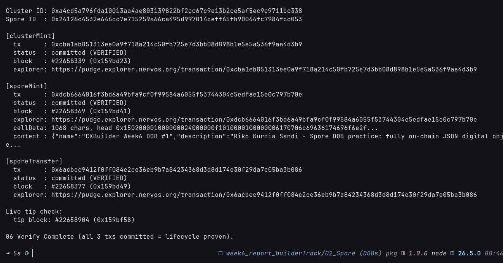

# 🚀 06 - On-Chain Spore Practice (Cluster → Mint → Transfer)

> **Live Pudge lifecycle with the builder-track key: create Cluster, mint clustered JSON DOB, zero-fee transfer — all committed, all explorer-verifiable**
> Handbook Intermediate (Spore) applied end-to-end via `@spore-sdk/core` + secp256k1 wallet. Melt deferred to preserve the artifact.

**Module**: Week 6 - Spore DOBs (02_Spore)  
**Author**: Riko Kurnia Sandi  
**Official References**: [Create Spore](https://docs.spore.pro/recipes/Create/create-spore) | [Transfer Spore](https://docs.spore.pro/recipes/Transfer/transfer-spore) | [Melt Spore](https://docs.spore.pro/recipes/Melt/melt-spore) | [createSpore.ts](https://github.com/sporeprotocol/spore-sdk/blob/beta/examples/secp256k1/apis/createSpore.ts) | [transferSpore.ts](https://github.com/sporeprotocol/spore-sdk/blob/beta/examples/secp256k1/apis/transferSpore.ts)

---

## 🌟 Executive Summary

Three sequential Pudge transactions prove the full Spore custodial loop with one key (`ckt1qzda0cr08m85hc8jlnfp3zer7xulejywt49kt2rr0vthywaa50xwsqwy0rpn3trq0sj2q6arv7xaq9w6m6xa0egxe8xvr`, reused from Week4/5, ~59k CKB funded):

1. **Cluster mint** — `CKBuilder Week6 Spore Collection` collection cell, Cluster ID `0xa4cd...`.
2. **Spore mint** — clustered `application/json` DOB (457 B, `CKBuilder Week6 DOB #1` + attributes), Spore ID `0x24126c...`, 660 CKB cell.
3. **Spore transfer** — `transferSpore` to same owner lock, exercising the zero-fee path (margin-funded, receiver needs no gas).

A read-only verifier re-queries all three via `get_transaction` so anyone can reproduce the proof without spending.

---

## 🔗 On-Chain Testnet Verification Proof

| Step | Primitive | Transaction Hash | Block | Status |
| :--- | :--- | :--- | :---: | :---: |
| Cluster create | Cluster cell (`name` + `description`, Type ID) | [`0xcba1eb85...aa4d3b9`](https://pudge.explorer.nervos.org/transaction/0xcba1eb851313ee0a9f718a214c50fb725e7d3bb08d898b1e5e5a536f9aa4d3b9) | `#22,658,339` (`0x159bd23`) | 🟢 Committed |
| Spore mint | Clustered JSON DOB (457 B, Spore ID `0x24126c...`, output 1, 660 CKB) | [`0xdcb66640...797b70e`](https://pudge.explorer.nervos.org/transaction/0xdcb6664016f3bd6a49bfa9cf0f99584a6055f53744304e5edfae15e0c797b70e) | `#22,658,369` (`0x159bd41`) | 🟢 Committed |
| Spore transfer | `transferSpore` zero-fee (same owner lock) | [`0x6acbec94...ba3b086`](https://pudge.explorer.nervos.org/transaction/0x6acbec9412f0ff084e2ce36eb9b7a84234368d3d8d174e30f29da7e05ba3b086) | `#22,658,377` (`0x159bd49`) | 🟢 Committed |

| Parameter | Value / Details |
| :--- | :--- |
| **Network** | CKB Public Testnet (Pudge), `https://testnet.ckb.dev/rpc` |
| **Signer** | `ckt1qzda0cr08m85hc8jlnfp3zer7xulejywt49kt2rr0vthywaa50xwsqwy0rpn3trq0sj2q6arv7xaq9w6m6xa0egxe8xvr` |
| **Cluster ID** | `0xa4cd5a796fda10013aa4ae803139822bf2cc67c9e13b2ce5af5ec9c9711bc338` |
| **Spore ID** | `0x24126c4532e646cc7e715259a66ca495d997014ceff65fb90044fc7984fcc053` |
| **Spore Content** | `application/json`, 457 B (`CKBuilder Week6 DOB #1` + 4 attributes, `clusterId` bound) |
| **Melt** | Deferred (DOB is meltable, no `immortal` flag; preserved for grading) |

---

## 📸 Screenshots & Proof of Work




> Save captures as `06_onchain-practice/images/foto-6a.png` (mint), `foto-6b.png` (transfer), `foto-6c.png` (verify). Run commands below, screenshot.

---

## ⚙️ Step-by-Step Practical Execution

1. **Wallet**: `hd.key.privateKeyToBlake160(PRIVATE_KEY)` → lock `codeHash 0x9bd7...`, `args 0xc478...dd7e5` → address `ckt1qzda...` (same as Week4/5).
2. **Cluster**: `createCluster({ data:{name, description}, fromInfos:[address], toLock })` → `outputIndex 0`, Cluster ID = Type ID `hash(first_input)|index` → `signAndSend` → `0xcba1...` → committed `#22658339`.
3. **Mint**: `createSpore({ data:{contentType:"application/json", content: bytifyRawString(JSON 457 B), clusterId}, fromInfos, toLock })` → `outputIndex 1`, Spore ID `0x24126c...`, 660 CKB → `0xdcb6...` → committed `#22658369`.
4. **Transfer**: `transferSpore({ outPoint:{txHash: 0xdcb6..., index: 0x1}, toLock })` → 1-in/1-out → `0x6acb...` → committed `#22658377`.
5. **Verify (read-only)**: `get_transaction × 3` → all `committed`; decode `outputs_data[1]` → `{"name":"CKBuilder Week6 DOB #1",...}` round-trips.

---

## 💻 Terminal Execution Output (verify — reproducible without spend)

```text
===============================================================
06 - SPORE LIFECYCLE VERIFY (READ-ONLY, PUDGE TESTNET)
===============================================================

Cluster ID: 0xa4cd5a796fda10013aa4ae803139822bf2cc67c9e13b2ce5af5ec9c9711bc338
Spore ID  : 0x24126c4532e646cc7e715259a66ca495d997014ceff65fb90044fc7984fcc053

[clusterMint]
  tx      : 0xcba1eb851313ee0a9f718a214c50fb725e7d3bb08d898b1e5e5a536f9aa4d3b9
  status  : committed (VERIFIED)
  block   : #22658339 (0x159bd23)
  explorer: https://pudge.explorer.nervos.org/transaction/0xcba1eb851313ee0a9f718a214c50fb725e7d3bb08d898b1e5e5a536f9aa4d3b9

[sporeMint]
  tx      : 0xdcb6664016f3bd6a49bfa9cf0f99584a6055f53744304e5edfae15e0c797b70e
  status  : committed (VERIFIED)
  block   : #22658369 (0x159bd41)
  explorer: https://pudge.explorer.nervos.org/transaction/0xdcb6664016f3bd6a49bfa9cf0f99584a6055f53744304e5edfae15e0c797b70e
  cellData: 1068 chars, head 0x150200001000000024000000f1010000100000006170706c69636174696f6e2f...
  content : {"name":"CKBuilder Week6 DOB #1","description":"Riko Kurnia Sandi - Spore DOB practice: fully on-chain JSON digital obje...

[sporeTransfer]
  tx      : 0x6acbec9412f0ff084e2ce36eb9b7a84234368d3d8d174e30f29da7e05ba3b086
  status  : committed (VERIFIED)
  block   : #22658377 (0x159bd49)
  explorer: https://pudge.explorer.nervos.org/transaction/0x6acbec9412f0ff084e2ce36eb9b7a84234368d3d8d174e30f29da7e05ba3b086

06 Verify Complete (all 3 txs committed = lifecycle proven).
```

Live mint/transfer outputs (author run, for the record):

```text
SPORE LIVE MINT (CLUSTERED JSON DOB) - CKB Testnet
Signer: ckt1qzda0cr08m85hc8jlnfp3zer7xulejywt49kt2rr0vthywaa50xwsqwy0rpn3trq0sj2q6arv7xaq9w6m6xa0egxe8xvr
Spore output index: 1
Spore ID (Type ID args): 0x24126c4532e646cc7e715259a66ca495d997014ceff65fb90044fc7984fcc053
Spore capacity: 0xf5de81400 (660 CKB)
Transaction Hash: 0xdcb6664016f3bd6a49bfa9cf0f99584a6055f53744304e5edfae15e0c797b70e
Committed in block 22658369 (0x159bd41)

SPORE TRANSFER (ZERO-FEE DEMO) - CKB Testnet
Transaction Hash: 0x6acbec9412f0ff084e2ce36eb9b7a84234368d3d8d174e30f29da7e05ba3b086
Committed in block 22658377 (0x159bd49)
```

---

## 🚀 Reproduction Guide

```bash
cd "week6_report_builderTrack/02_Spore (DOBs)"
npm install
# Read-only proof (no spend, screenshot this):
node "06_onchain-practice/scripts/spore_lifecycle_verify.js"
# Live re-mint (spends testnet CKB, creates NEW IDs/hashes):
node "06_onchain-practice/scripts/cluster_create_demo.js"
node "06_onchain-practice/scripts/spore_mint_demo.js"
node "06_onchain-practice/scripts/spore_transfer_demo.js"
```

## 🛡️ Evidence Boundaries

| Capability | Current evidence |
|---|---|
| Cluster mint | Real Pudge tx `0xcba1...`, Cluster ID `0xa4cd...` |
| Spore mint (clustered JSON) | Real Pudge tx `0xdcb6...`, Spore ID `0x24126c...`, 660 CKB, content round-trips |
| Zero-fee transfer | Real Pudge tx `0x6acb...` via `transferSpore` |
| Melt / redeem | Deferred by design; DOB meltable, artifact preserved |
| Decoder server run | Simulated in 05; no `:8090` launched here |
| Mainnet / production | None — testnet only |

---

## 🔗 Next

Spore lifecycle complete. Remaining Handbook Spore item is the optional melt + `dob_decode` against a live Rust server; DAO phase-2 claim (epoch `14139`) stays calendar-gated in `01_Nervos DAO`.
