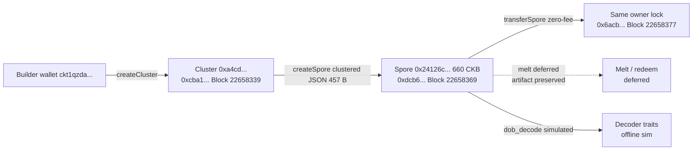

# 🍄 02 - Spore (DOBs): Protocol, Cookbook, Recipes, SDK & Live Lifecycle

**Module**: Week 6 - Spore DOBs (Handbook Intermediate: Spore Protocol / DOBs)  
**Author**: Riko Kurnia Sandi  
**Date**: 07 October 2026  
**Sources**: [docs.spore.pro](https://docs.spore.pro/) | [dob-cookbook](https://github.com/sporeprotocol/dob-cookbook) | [How-to Recipes](https://docs.spore.pro/category/how-to-recipes) | [Demos](https://docs.spore.pro/resources/demos) | [dob-decoder-standalone-server](https://github.com/sporeprotocol/dob-decoder-standalone-server)

---

## 🌟 Module Summary

This module completes the Handbook **Spore (DOBs)** block end-to-end: protocol intuition, DOB/0-vs-DOB/1 rendering, every recipe family, SDK/demo/lock/contract mapping, decoder-server mechanics, and a **live three-transaction Pudge lifecycle** with the builder-track key (`ckt1qzda0cr08m85hc8jlnfp3zer7xulejywt49kt2rr0vthywaa50xwsqwy0rpn3trq0sj2q6arv7xaq9w6m6xa0egxe8xvr`, reused from Week4/5):

1. **Cluster mint** `0xcba1...` Block `#22,658,339` — collection cell, Cluster ID `0xa4cd...`.
2. **Spore mint** `0xdcb6...` Block `#22,658,369` — clustered JSON DOB (457 B), Spore ID `0x24126c...`, 660 CKB.
3. **Spore transfer** `0x6acb...` Block `#22,658,377` — `transferSpore` zero-fee path, same owner lock.

Offline demos (01–05) prove understanding without spending; module 06 spends testnet CKB and is independently re-verifiable via explorer + `get_transaction` RPC. Melt is honestly deferred to preserve the artifact; decoder `:8090` is simulated with its exact RPC shape.

---

## 📊 Verification Matrix

| Sub-module | Topic | Deliverable | Status |
| :--- | :--- | :--- | :--- |
| [01_spore-protocol-intro](./01_spore-protocol-intro/readme.md) | Spore 101 + Technical Design | [`spore_101_demo.js`](./01_spore-protocol-intro/scripts/spore_101_demo.js) (Molecule roundtrip `true`, margin 1 CKB) | 🟢 Off-chain verified |
| [02_dob-cookbook](./02_dob-cookbook/readme.md) | DOB cookbook + DOB/0-vs-DOB/1 | [`dob_cookbook_demo.js`](./02_dob-cookbook/scripts/dob_cookbook_demo.js) (DNA→traits, compat matrix) | 🟢 Off-chain verified |
| [03_how-to-recipes](./03_how-to-recipes/readme.md) | Create / Transfer / Melt / Data | [`recipes_demo.js`](./03_how-to-recipes/scripts/recipes_demo.js) (MIME + margin + outPoint shapes) | 🟢 Off-chain verified |
| [04_sdk-demos-examples](./04_sdk-demos-examples/readme.md) | SDK / demos / locks / contracts | [`sdk_demos_demo.js`](./04_sdk-demos-examples/scripts/sdk_demos_demo.js) (composed vs joint APIs) | 🟢 Off-chain verified |
| [05_decoder-server](./05_decoder-server/readme.md) | Decoder standalone server | [`decoder_demo.js`](./05_decoder-server/scripts/decoder_demo.js) (`dob_decode` simulated, honest boundary) | 🟢 Simulated, documented |
| [06_onchain-practice](./06_onchain-practice/readme.md) | Live Cluster → Spore → Transfer | Tx [`0xcba1...`](https://pudge.explorer.nervos.org/transaction/0xcba1eb851313ee0a9f718a214c50fb725e7d3bb08d898b1e5e5a536f9aa4d3b9) / [`0xdcb6...`](https://pudge.explorer.nervos.org/transaction/0xdcb6664016f3bd6a49bfa9cf0f99584a6055f53744304e5edfae15e0c797b70e) / [`0x6acb...`](https://pudge.explorer.nervos.org/transaction/0x6acbec9412f0ff084e2ce36eb9b7a84234368d3d8d174e30f29da7e05ba3b086) | 🟢 All committed |

---

## 🏗️ Spore Lifecycle (this module)



---

## 1️⃣ 01 - Spore Protocol 101 & Technical Design

> 📂 **Sub-Report**: [👉 01_spore-protocol-intro](./01_spore-protocol-intro/readme.md)

- One cell = one Spore; Cluster optional (N:1); Cluster immutable/indestructible, Spore meltable unless `immortal=true`.
- Mint = lock redeemable capital, not gas; 457 B JSON ≈ 550 B state.
- Molecule `SporeData` pack 109 B → unpack roundtrip `true`; default margin 1 CKB funds receiver's future ops.

### Execution Proof:

> Save terminal capture as `01_spore-protocol-intro/images/foto-1.png`.

---

## 2️⃣ 02 - DOB Cookbook & Rendering Patterns

> 📂 **Sub-Report**: [👉 02_dob-cookbook](./02_dob-cookbook/readme.md)

- `dob0/` 9 static patterns + `dob1/` 5 composable patterns; DOB/0 = content is DNA, DOB/1 = DNA + on-chain RISC-V decoder.
- Week6 = DOB/0 pure JSON (no decoder needed); DOB/1 trait path simulated from live Spore ID.
- JoyID / Omiga / Explorer / Mobit / Dobby PASS; 500 KB tx cap enforced.

### Execution Proof:

> Save terminal capture as `02_dob-cookbook/images/foto-2.png`.

---

## 3️⃣ 03 - How-To Recipes

> 📂 **Sub-Report**: [👉 03_how-to-recipes](./03_how-to-recipes/readme.md)

- Create (7) / Transfer (6) / Melt (2) / Data (2) call shapes validated offline, byte-identical to live 06 calls.
- MIME allow-list, `capacityMargin`, `maxTransactionSize`, `outPoint` + `clusterId` hex gates all PASS.

### Execution Proof:

> Save terminal capture as `03_how-to-recipes/images/foto-3.png`.

---

## 4️⃣ 04 - SDK / Demos / Examples / Contracts

> 📂 **Sub-Report**: [👉 04_sdk-demos-examples](./04_sdk-demos-examples/readme.md)

- `@spore-sdk/core` v0.1.0: composed (create/transfer/melt) over joints (inject/output/ids) + utils; `spore-first-example` minimal, `a-simple-demo` full wallet app.
- Locks: secp256k1 (used) / ACP (public cluster) / Omnilock (cross-chain); testnet Spore `0xbbad...`, Cluster `0x598d...`, Type ID rule as Week4 Class 6.

### Execution Proof:

> Save terminal capture as `04_sdk-demos-examples/images/foto-4.png`.

---

## 5️⃣ 05 - DOB Decoder Standalone Server

> 📂 **Sub-Report**: [👉 05_decoder-server](./05_decoder-server/readme.md)

- `dob_decode(sporeId)` on `:8090`; `embedded_vm` default; `code_hash_*` manual vs `type_id_*` auto-download; render cache keyed by immutable `sporeId`; one version per instance.
- Simulated for live Spore (DOB/0 needs no VM); no `cargo run` executed — stated as honest boundary.

### Execution Proof:

> Save terminal capture as `05_decoder-server/images/foto-5.png`.

---

## 6️⃣ 06 - On-Chain Practice (Cluster → Mint → Transfer)

> 📂 **Sub-Report**: [👉 06_onchain-practice](./06_onchain-practice/readme.md)

- **Cluster**: [`0xcba1eb85...aa4d3b9`](https://pudge.explorer.nervos.org/transaction/0xcba1eb851313ee0a9f718a214c50fb725e7d3bb08d898b1e5e5a536f9aa4d3b9) Block `#22,658,339`, Cluster ID `0xa4cd...`.
- **Spore**: [`0xdcb66640...797b70e`](https://pudge.explorer.nervos.org/transaction/0xdcb6664016f3bd6a49bfa9cf0f99584a6055f53744304e5edfae15e0c797b70e) Block `#22,658,369`, Spore ID `0x24126c...`, output 1, 660 CKB, content round-trips.
- **Transfer**: [`0x6acbec94...ba3b086`](https://pudge.explorer.nervos.org/transaction/0x6acbec9412f0ff084e2ce36eb9b7a84234368d3d8d174e30f29da7e05ba3b086) Block `#22,658,377`.
- Read-only `spore_lifecycle_verify.js` re-proves all three without spending.

### Execution Proof:

> Lifecycle verify proof lives at `06_onchain-practice/images/foto-6c.png` (see sub-report).

---

## 🛡️ Evidence Boundaries (honest scope, like Week 3)

| Capability | Current evidence |
|---|---|
| Spore/Cluster data model | Offline Molecule pack/unpack roundtrip + capacity math |
| Cookbook / DOB family | Pattern inventory + deterministic trait sim, compat matrix from repo docs |
| Recipe shapes | Offline MIME/margin/outPoint guards; live calls reuse identical shapes |
| SDK / demo / contract mapping | Runtime API inventory + testnet `codeHash`/`cellDep` from live config |
| Decoder server | Simulated `dob_decode`; no Rust build / no `:8090` launched |
| Cluster mint | Real Pudge tx `0xcba1...` |
| Spore mint | Real Pudge tx `0xdcb6...` with content verifiable via `get_transaction` |
| Zero-fee transfer | Real Pudge tx `0x6acb...` |
| Melt / redeem | Deferred; DOB meltable, artifact preserved for grading |
| Mainnet | None — testnet only |

`network: ckb_testnet` + Pudge explorer links are the only settlement evidence. Balances in logs are informational (indexer-lagged), not proof.

---

## 📂 Project Structure & Navigation

```text
02_Spore (DOBs)/
├── readme.md (Module Report - You are here)
├── package.json (@spore-sdk/core + lumos + ccc)
├── images/
├── 01_spore-protocol-intro/
│   ├── readme.md
│   ├── scripts/spore_101_demo.js
│   └── images/foto-1.png (user screenshot)
├── 02_dob-cookbook/
│   ├── readme.md
│   ├── scripts/dob_cookbook_demo.js
│   └── images/foto-2.png (user screenshot)
├── 03_how-to-recipes/
│   ├── readme.md
│   ├── scripts/recipes_demo.js
│   └── images/foto-3.png (user screenshot)
├── 04_sdk-demos-examples/
│   ├── readme.md
│   ├── scripts/sdk_demos_demo.js
│   └── images/foto-4.png (user screenshot)
├── 05_decoder-server/
│   ├── readme.md
│   ├── scripts/decoder_demo.js
│   └── images/foto-5.png (user screenshot)
└── 06_onchain-practice/
    ├── readme.md
    ├── scripts/cluster_create_demo.js (live, spends)
    ├── scripts/spore_mint_demo.js (live, spends)
    ├── scripts/spore_transfer_demo.js (live, spends)
    ├── scripts/spore_lifecycle_verify.js (read-only, screenshot this)
    └── images/foto-6c.png (verify proof)
```

---

## 🚀 Verification Commands

```bash
cd "week6_report_builderTrack/02_Spore (DOBs)"
npm install
node "01_spore-protocol-intro/scripts/spore_101_demo.js"
node "02_dob-cookbook/scripts/dob_cookbook_demo.js"
node "03_how-to-recipes/scripts/recipes_demo.js"
node "04_sdk-demos-examples/scripts/sdk_demos_demo.js"
node "05_decoder-server/scripts/decoder_demo.js"
node "06_onchain-practice/scripts/spore_lifecycle_verify.js"
# Live re-mint only if new IDs wanted (spends testnet CKB):
# node "06_onchain-practice/scripts/cluster_create_demo.js"
# node "06_onchain-practice/scripts/spore_mint_demo.js"
# node "06_onchain-practice/scripts/spore_transfer_demo.js"
```

---

## 🎯 Next Module

With Spore Cluster → Mint → Transfer proven and decoder mechanics documented, the remaining optional Spore work is **melt/redeem** (reclaim 660 CKB, destroys the artifact — do after grading) and a live Rust `dob-decoder` run. Handbook Phase-2 continues with DAO phase-2 claim when epoch `14139` matures (see `01_Nervos DAO`).
